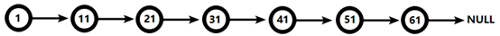
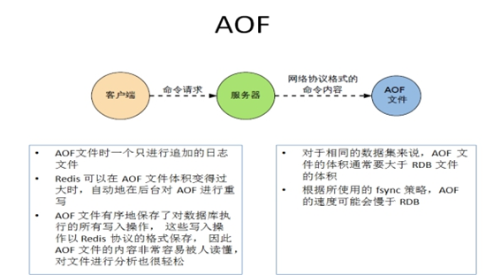
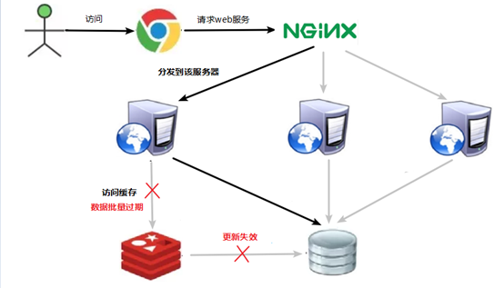

# 一、NoSQL数据库简介

## 1.技术的分类

1. 解决功能性的问题：Java、Jsp、RDBMS、Tomcat、HTML、Linux、JDBC、SVN

2. 解决扩展性的问题：Struts、Spring、SpringMVC、Hibernate、Mybatis

3. 解决性能的问题：NoSQL、Java线程、Hadoop、Nginx、MQ、ElasticSearch

## 2.NoSQL数据库

NoSQL(NoSQL = **Not Only SQL** )，意即“不仅仅是SQL”，泛指**非关系型的数据库**。 NoSQL 不依赖业务逻辑方式存储，而以简单的key-value模式存储。因此大大的增加了数据库的扩展能力。

* 不遵循SQL标准。

* 不支持ACID。

* 远超于SQL的性能。

1. NoSQL适用场景 

* 对数据高并发的读写

*  海量数据的读写

* 对数据高可扩展性的

2. NoSQL不适用场景

* 需要事务支持

* 基于sql的结构化查询存储，处理复杂的关系,需要即席查询。

* （用不着sql的和用了sql也不行的情况，请考虑用NoSql）

# 二、Redis安装

## 1.文件介绍

redis-benchmark:性能测试工具，可以在自己本子运行，看看自己本子性能如何

redis-check-aof：修复有问题的AOF文件，rdb和aof后面讲

redis-check-dump：修复有问题的dump.rdb文件

redis-sentinel：Redis集群使用

redis-server：Redis服务器启动命令

redis-cli：客户端，操作入口

## 2.Redis命令

启动：redis-server  redis.conf

用客户端访问：redis-cli  多个端口可以：redis-cli -p6379

关闭：redis-cli shutdown   指定端口关闭：redis-cli -p 6379 shutdown

## 3.相关知识

默认16个数据库，类似数组下标从0开始，初始默认使用0号库

使用命令 select  <dbid>来切换数据库。如: select 8 

统一密码管理，所有库同样密码。

dbsize查看当前数据库的key的数量

flushdb清空当前库

flushall通杀全部库

# 三、数据类型

## 1.Redis键(key)

``` python
keys *查看当前库所有key    (匹配：keys *1)
exists key判断某个key是否存在
type key 查看你的key是什么类型
del key       删除指定的key数据
unlink key   根据value选择非阻塞删除,仅将keys从keyspace元数据中删除，真正的删除会在后续异步操作。
expire key 10   10秒钟：为给定的key设置过期时间
ttl key 查看还有多少秒过期，-1表示永不过期，-2表示已过期
select命令切换数据库
dbsize查看当前数据库的key的数量
flushdb清空当前库
flushall通杀全部库
```

## 2.Redis字符串(String)

``` python
set  <key> <value>添加键值对
get   <key>查询对应键值
append  <key> <value>将给定的<value> 追加到原值的末尾
strlen  <key>获得值的长度
setnx  <key> <value>只有在 key 不存在时 设置 key 的值
incr  <key> 将 key 中储存的数字值增1 只能对数字值操作，如果为空，新增值为1
decr  <key> 将 key 中储存的数字值减1 只能对数字值操作，如果为空，新增值为-1
incrby / decrby  <key> <步长> 将key 中储存的数字值增减，自定义步长。

mset  <key1><value1><key2><value2>  ..... 
同时设置一个或多个 key-value对  
mget  <key1><key2><key3> .....
同时获取一个或多个 value  
msetnx <key1><value1><key2><value2>  ..... 
同时设置一个或多个 key-value 对，当且仅当所有给定 key 都不存在。
getrange  <key><起始位置><结束位置> 获得值的范围，前包，后包
setrange  <key><起始位置><value>
用 <value>  覆写<key>所储存的字符串值，从<起始位置>开始(索引从0开始)。
setex  <key><过期时间><value>
设置键值的同时，设置过期时间，单位秒。
getset <key><value>
以新换旧，设置了新值同时获得旧值。
```

String的数据结构为简单动态字符串(Simple Dynamic String,缩写SDS)。是可以修改的字符串，内部结构实现上类似于Java的ArrayList，采用预分配冗余空间的方式来减少内存的频繁分配。


如图中所示，内部为当前字符串实际分配的空间capacity一般要高于实际字符串长度len。当字符串长度小于1M时，扩容都是加倍现有的空间，如果超过1M，扩容时一次只会多扩1M的空间。需要注意的是字符串最大长度为512M。

## 3.列表（List)

### 1）简介

单键多值

Redis 列表是简单的字符串列表，按照插入顺序排序。你可以添加一个元素到列表的头部（左边）或者尾部（右边）。

### 2）常见命令

```p
lpush/rpush  <key><value1><value2><value3> .... 从左边/右边插入一个或多个值。
lpop/rpop  <key>从左边/右边吐出一个值。值在键在，值光键亡。

rpoplpush  <key1><key2>从<key1>列表右边吐出一个值，插到<key2>列表左边。

lrange <key><start><stop>
按照索引下标获得元素(从左到右)
lrange mylist 0 -1   0左边第一个，-1右边第一个，（0-1表示获取所有）
lindex <key><index>按照索引下标获得元素(从左到右)
llen <key>获得列表长度 

linsert <key>  before <value><newvalue>在<value>的后面插入<newvalue>插入值
lrem <key><n><value>从左边删除n个value(从左到右)
lset<key><index><value>将列表key下标为index的值替换成value
```

### 3）数据结构

List的数据结构为快速链表quickList。

首先在列表元素较少的情况下会使用一块连续的内存存储，这个结构是ziplist，也即是压缩列表。它将所有的元素紧挨着一起存储，分配的是一块连续的内存。

当数据量比较多的时候才会改成quicklist。因为普通的链表需要的附加指针空间太大，会比较浪费空间。比如这个列表里存的只是int类型的数据，结构上还需要两个额外的指针prev和next。  


Redis将链表和ziplist结合起来组成了quicklist。也就是将多个ziplist使用双向指针串起来使用。这样既满足了快速的插入删除性能，又不会出现太大的空间冗余。

## 4.集合（Set）

### 1）简介

Redis set对外提供的功能与list类似是一个列表的功能，特殊之处在于set是可以**自动排重**的，当你需要存储一个列表数据，又不希望出现重复数据时，set是一个很好的选择，并且set提供了判断某个成员是否在一个set集合内的重要接口，这个也是list所不能提供的。

Redis的Set是string类型的无序集合。它底层其实是一个value为null的hash表，所以添加，删除，查找的**复杂度都是**O(1)。

一个算法，随着数据的增加，执行时间的长短，如果是O(1)，数据增加，查找数据的时间不变

### 2）常见命令

``` python
sadd <key><value1><value2> ..... 
将一个或多个 member 元素加入到集合 key 中，已经存在的 member 元素将被忽略
smembers <key>取出该集合的所有值。
sismember <key><value>判断集合<key>是否为含有该<value>值，有1，没有0
scard<key>返回该集合的元素个数。
srem <key><value1><value2> .... 删除集合中的某个元素。
spop <key>随机从该集合中吐出一个值。
srandmember <key><n>随机从该集合中取出n个值。不会从集合中删除 。
smove <source><destination>value把集合中一个值从一个集合移动到另一个集合
sinter <key1><key2>返回两个集合的交集元素。
sunion <key1><key2>返回两个集合的并集元素。
sdiff <key1><key2>返回两个集合的差集元素(key1中的，不包含key2中的)
```

### 3）数据结构

Set数据结构是dict字典，字典是用哈希表实现的。

Java中HashSet的内部实现使用的是HashMap，只不过所有的value都指向同一个对象。Redis的set结构也是一样，它的内部也使用hash结构，所有的value都指向同一个内部值。

## 5.哈希（Hash)

### 1）简介

Redis hash 是一个键值对集合。

Redis hash是一个string类型的field和value的映射表，hash特别适合用于存储对象。

类似Java里面的Map<String,Object>

用户ID为查找的key，存储的value用户对象包含姓名，年龄，生日等信息，如果用普通的key/value结构来存储


通过 key(用户ID) + field(属性标签) 就可以操作对应属性数据了，既不需要重复存储数据，也不会带来序列化和并发修改控制的问题

### 2）常见命令

``` python
hset <key><field><value> 给<key>集合中的<field>键赋值<value>
hget <key1><field>从<key1>集合<field>取出 value 
hmset <key1><field1><value1><field2><value2>... 批量设置hash的值
hexists<key1><field>查看哈希表 key 中，给定域 field 是否存在。 
hkeys <key>列出该hash集合的所有field
hvals <key>列出该hash集合的所有value
hincrby <key><field><increment>为哈希表 key 中的域 field 的值加上增量 1   -1
hsetnx <key><field><value>将哈希表 key 中的域 field 的值设置为 value ，当且仅当域 field 不存在 .
```

### 3）数据结构

Hash类型对应的数据结构是两种：ziplist（压缩列表），hashtable（哈希表）。当field-value长度较短且个数较少时，使用ziplist，否则使用hashtable。

## 6.有序集合(Zset)

### 1）简介

Redis有序集合zset与普通集合set非常相似，是一个没有重复元素的字符串集合。

不同之处是有序集合的每个成员都关联了一个**评分（score）**,这个评分（score）被用来按照从最低分到最高分的方式排序集合中的成员。集合的成员是唯一的，但是评分可以是重复了 。

因为元素是有序的, 所以你也可以很快的根据评分（score）或者次序（position）来获取一个范围的元素。

访问有序集合的中间元素也是非常快的,因此你能够使用有序集合作为一个没有重复成员的智能列表。

### 2）常见命令

``` python
zadd  <key><score1><value1><score2><value2>…
将一个或多个 member 元素及其 score 值加入到有序集 key 当中。
zrange <key><start><stop>  [WITHSCORES]   
返回有序集 key 中，下标在<start><stop>之间的元素
带WITHSCORES，可以让分数一起和值返回到结果集。
zrangebyscore key minmax [withscores] [limit offset count]
返回有序集 key 中，所有 score 值介于 min 和 max 之间(包括等于 min 或 max )的成员。有序集成员按 score 值递增(从小到大)次序排列。 
zrevrangebyscore key maxmin [withscores] [limit offset count]               
同上，改为从大到小排列。 
zincrby <key><increment><value>      为元素的score加上增量
zrem  <key><value>删除该集合下，指定值的元素 
zcount <key><min><max>统计该集合，分数区间内的元素个数 
zrank <key><value>返回该值在集合中的排名，从0开始。

```

### 3）数据结构

SortedSet(zset)是Redis提供的一个非常特别的数据结构，一方面它等价于Java的数据结构Map<String, Double>，可以给每一个元素value赋予一个权重score，另一方面它又类似于TreeSet，内部的元素会按照权重score进行排序，可以得到每个元素的名次，还可以通过score的范围来获取元素的列表。

zset底层使用了两个数据结构

（1）hash，hash的作用就是关联元素value和权重score，保障元素value的唯一性，可以通过元素value找到相应的score值。

（2）跳跃表，跳跃表的目的在于给元素value排序，根据score的范围获取元素列表。

### 4）跳跃表

1. 简介

  有序集合在生活中比较常见，例如根据成绩对学生排名，根据得分对玩家排名等。对于有序集合的底层实现，可以用数组、平衡树、链表等。数组不便元素的插入、删除；平衡树或红黑树虽然效率高但结构复杂；链表查询需要遍历所有效率低。Redis采用的是跳跃表。跳跃表效率堪比红黑树，实现远比红黑树简单。

2. 实例

  对比有序链表和跳跃表，从链表中查询出51

（1）有序链表 



要查找值为51的元素，需要从第一个元素开始依次查找、比较才能找到。共需要6次比较。

（2）跳跃表


从第2层开始，1节点比51节点小，向后比较。

21节点比51节点小，继续向后比较，后面就是NULL了，所以从21节点向下到第1层

在第1层，41节点比51节点小，继续向后，61节点比51节点大，所以从41向下

在第0层，51节点为要查找的节点，节点被找到，共查找4次。

从此可以看出跳跃表比有序链表效率要高

# 四、Redis配置文件介绍

## 1.Units单位

配置大小单位,开头定义了一些基本的度量单位，只支持bytes，不支持bit大小写不敏感

## 2.INCLUDES包含

类似jsp中的include，多实例的情况可以把公用的配置文件提取出来

## 3.网络相关配置

1. 默认情况bind=127.0.0.1只能接受本机的访问请求,不写的情况下，无限制接受任何ip地址的访问,生产环境肯定要写你应用服务器的地址；服务器是需要远程访问的，所以需要将其注释掉
2. 如果开启了protected-mode，那么在没有设定bind ip且没有设密码的情况下，Redis只允许接受本机的响应
3. Port端口号，默认 6379
4. tcp-backlog 设置tcp的backlog，backlog其实是一个连接队列，backlog队列总和=未完成三次握手队列 + 已经完成三次握手队列。
5. imeout 一个空闲的客户端维持多少秒会关闭，0表示关闭该功能。即永不关闭
6. tcp-keepalive:对访问客户端的一种心跳检测，每个n秒检测一次。单位为秒，如果设置为0，则不会进行Keepalive检测，建议设置成60 

7. daemonize:是否为后台进程，设置为yes,守护进程，后台启动

8. pidfile:存放pid文件的位置，每个实例会产生一个不同的pid文件

9. **loglevel** :指定日志记录级别，Redis总共支持四个级别：debug、verbose、notice、warning，默认为**notice**

   四个级别根据使用阶段来选择，生产环境选择notice 或者warning

10.  **logfile** :日志文件名称

11. databases 16:设定库的数量 默认16，默认数据库为0，可以使用SELECT <dbid>命令在连接上指定数据库id

12. maxclients

    Ø 设置redis同时可以与多少个客户端进行连接。

    Ø 默认情况下为10000个客户端。

    Ø 如果达到了此限制，redis则会拒绝新的连接请求，并且向这些连接请求方发出“max number of clients reached”以作回应。

13. **maxmemory** 

    Ø 建议**必须设置**，否则，将内存占满，造成服务器宕机

    Ø 设置redis可以使用的内存量。一旦到达内存使用上限，redis将会试图移除内部数据，移除规则可以通过maxmemory-policy来指定。

14. **maxmemory-policy**

    Ø volatile-lru：使用LRU算法移除key，只对设置了过期时间的键；（最近最少使用）

    Ø allkeys-lru：在所有集合key中，使用LRU算法移除key

    Ø volatile-random：在过期集合中移除随机的key，只对设置了过期时间的键

    Ø allkeys-random：在所有集合key中，移除随机的key

    Ø volatile-ttl：移除那些TTL值最小的key，即那些最近要过期的key

    Ø noeviction：不进行移除。针对写操作，只是返回错误信息

15. **maxmemory-samples**

    Ø 设置样本数量，LRU算法和最小TTL算法都并非是精确的算法，而是估算值，所以你可以设置样本的大小，redis默认会检查这么多个key并选择其中LRU的那个。

    Ø 一般设置3到7的数字，数值越小样本越不准确，但性能消耗越小。

# 五、Redis的发布和订阅

Redis 发布订阅 (pub/sub) 是一种消息通信模式：发送者 (pub) 发送消息，订阅者 (sub) 接收消息。

Redis 客户端可以订阅任意数量的频道。

1. 客户端可以订阅频道如下图  

   SUBSCRIBE channel1

   

2. 当给这个频道发布消息后，消息就会发送给订阅的客户端

   publish channel1 hello

   

# 六、Redis**新数据类型**

## 1. BitMaps

​	Redis提供了Bitmaps这个“数据类型”可以实现对位的操作：

* Bitmaps本身不是一种数据类型， 实际上它就是字符串（key-value） ， 但是它可以对字符串的位进行操作。

* Bitmaps单独提供了一套命令， 所以在Redis中使用Bitmaps和使用字符串的方法不太相同。 可以把Bitmaps想象成一个以位为单位的数组， 数组的每个单元只能存储0和1， 数组的下标在Bitmaps中叫做偏移量。

1. setbit<key><offset><value>设置Bitmaps中某个偏移量的值（0或1）

2. getbit<key><offset>获取Bitmaps中某个偏移量的值

3. bitcount<key>[start end] 统计字符串从start字节到end字节比特值为1的数量

4. bitop and(or/not/xor) <destkey> [key…]      bitop是一个复合操作， 它可以做多个Bitmaps的and（交集） 、 or（并集） 、 not（非） 、 xor（异或） 操作并将结果保存在destkey中。

## 2.HyperLogLog

1. pfadd <key>< element> [element ...]  添加指定元素到 HyperLogLog 中

2. pfmerge<destkey><sourcekey> [sourcekey ...] 将一个或多个HLL合并后的结果存储在另一个HLL中

## 3.Geospatial

1. geoadd<key>< longitude><latitude><member> [longitude latitude member...]  添加地理位置（经度，纬度，名称）
2. geopos <key><member> [member...] 获得指定地区的坐标值
3. geodist<key><member1><member2> [m|km|ft|mi ] 获取两个位置之间的直线距离
4. georadius<key>< longitude><latitude>radius m|km|ft|mi  以给定的经纬度为中心，找出某一半径内的元素

# 七、Redis\_事务\_锁机制\_秒杀

## 1.Redis的事务定义

Redis事务是一个单独的隔离操作：事务中的所有命令都会序列化、按顺序地执行。事务在执行的过程中，不会被其他客户端发送来的命令请求所打断。

Redis事务的主要作用就是串联多个命令防止别的命令插队。

## 2.Multi、Exec、discard

从输入Multi命令开始，输入的命令都会依次进入命令队列中，但不会执行，直到输入Exec后，Redis会将之前的命令队列中的命令依次执行。

组队的过程中可以通过discard来放弃组队。


## 3.事务的错误处理

组队中某个命令出现了报告错误，执行时整个的所有队列都会被取消。


如果执行阶段某个命令报出了错误，则只有报错的命令不会被执行，而其他的命令都会执行，不会回滚。


## 4.事务冲突的问题

1. 悲观锁

   

​		**悲观锁(Pessimistic Lock)**, 顾名思义，就是很悲观，每次去拿数据的时候都认为别人会修改，所以每次在拿数据的时候都会上锁，这样别人想拿这个数据就会block直到它拿到锁。**传统的关系型数据库里边就用到了很多这种锁机制**，比如**行锁**，**表锁**等，**读锁**，**写锁**等，都是在做操作之前先上锁。	

2. **乐观锁**

   

**乐观锁(Optimistic Lock),** 顾名思义，就是很乐观，每次去拿数据的时候都认为别人不会修改，所以不会上锁，但是在更新的时候会判断一下在此期间别人有没有去更新这个数据，可以使用版本号等机制。**乐观锁适用于多读的应用类型，这样可以提高吞吐量**。Redis就是利用这种check-and-set机制实现事务的。

```python
乐观锁：
WATCH key [key ...]
在执行multi之前，先执行watch key1 [key2],可以监视一个(或多个) key ，如果在事务执行之前这个(或这些) key 被其他命令所改动，那么事务将被打断。
unwatch
取消 WATCH 命令对所有 key 的监视。
如果在执行 WATCH 命令之后，EXEC 命令或DISCARD 命令先被执行了的话，那么就不需要再执行UNWATCH 了。
```


## 5.Redis事务三特性

* 单独的隔离操作 

​		n 事务中的所有命令都会序列化、按顺序地执行。事务在执行的过程中，不会被其他客户端发送来的命令请求所打断。 

* 没有隔离级别的概念 

​		n 队列中的命令没有提交之前都不会实际被执行，因为事务提交前任何指令都不会被实际执行

* 不保证原子性 

​		n 事务中如果有一条命令执行失败，其后的命令仍然会被执行，没有回滚 

# 八、Redis持久化之RDB

## 1.RDB

1. 在指定的时间间隔内将内存中的数据集快照写入磁盘， 也就是行话讲的Snapshot快照，它恢复时是将快照文件直接读到内存里

2. Redis会单独创建（fork）一个子进程来进行持久化，会先将数据写入到 一个临时文件中，待持久化过程都结束了，再用这个临时文件替换上次持久化好的文件。 整个过程中，主进程是不进行任何IO操作的，这就确保了极高的性能 如果需要进行大规模数据的恢复，且对于数据恢复的完整性不是非常敏感，那RDB方式要比AOF方式更加的高效。**RDB**的缺点是最后一次持久化后的数据可能丢失。
3. Fork

* Fork的作用是复制一个与当前进程一样的进程。新进程的所有数据（变量、环境变量、程序计数器等） 数值都和原进程一致，但是是一个全新的进程，并作为原进程的子进程

* 在Linux程序中，fork()会产生一个和父进程完全相同的子进程，但子进程在此后多会exec系统调用，出于效率考虑，Linux中引入了“**写时复制技术**”

* **一般情况父进程和子进程会共用同一段物理内存**，只有进程空间的各段的内容要发生变化时，才会将父进程的内容复制一份给子进程。

 4. **RDB**持久化流程

    


## 2.AOF

1. 是什么

   以**日志**的形式来记录每个写操作（增量保存），将Redis执行过的所有写指令记录下来(**读操作不记录**)， **只许追加文件但不可以改写文件**，redis启动之初会读取该文件重新构建数据，换言之，redis 重启的话就根据日志文件的内容将写指令从前到后执行一次以完成数据的恢复工作

2. **AOF持久化流程**

   （1）客户端的请求写命令会被append追加到AOF缓冲区内；

   （2）AOF缓冲区根据AOF持久化策略[always,everysec,no]将操作sync同步到磁盘的AOF文件中；

   （3）AOF文件大小超过重写策略或手动重写时，会对AOF文件rewrite重写，压缩AOF文件容量；

​	   （4）Redis服务重启时，会重新load加载AOF文件中的写操作达到数据恢复的目		的；


AOF和RDB同时开启，系统默认取AOF的数据（数据不会存在丢失）



# 九、**Redis_****主从复制**

## 1.**是什么**

主机数据更新后根据配置和策略， 自动同步到备机的master/slaver机制，**Master**以写为主，Slave以读为主

## 2.作用

 读写分离，性能扩展

 容灾快速恢复


## 3.复制原理

l Slave启动成功连接到master后会发送一个sync命令

l Master接到命令启动后台的存盘进程，同时收集所有接收到的用于修改数据集命令， 在后台进程执行完毕之后，master将传送整个数据文件到slave,以完成一次完全同步

l 全量复制：而slave服务在接收到数据库文件数据后，将其存盘并加载到内存中。

l 增量复制：Master继续将新的所有收集到的修改命令依次传给slave,完成同步

l 但是只要是重新连接master,一次完全同步（全量复制)将被自动执行

## 4.**薪火相传**

上一个Slave可以是下一个slave的Master，Slave同样可以接收其他 slaves的连接和同步请求，那么该slave作为了链条中下一个的master, 可以有效减轻master的写压力,去中心化降低风险。

## 5.**反客为主**

当一个master宕机后，后面的slave可以立刻升为master，其后面的slave不用做任何修改。

用 slaveof no one  将从机变为主机。

## 6.**哨兵模式**(sentinel)

**反客为主的自动版**，能够后台监控主机是否故障，如果故障了根据投票数自动将从库转换为主库

# 十、**Redis集群**

## 1.问题

容量不够，redis如何进行扩容？

并发写操作， redis如何分摊？

另外，主从模式，薪火相传模式，主机宕机，导致ip地址发生变化，应用程序中配置需要修改对应的主机地址、端口等信息。

之前通过代理主机来解决，但是redis3.0中提供了解决方案。就是无中心化集群配置。

## 2.**什么是集群**

Redis 集群实现了对Redis的水平扩容，即启动N个redis节点，将整个数据库分布存储在这N个节点中，每个节点存储总数据的1/N。

Redis 集群通过分区（partition）来提供一定程度的可用性（availability）： 即使集群中有一部分节点失效或者无法进行通讯， 集群也可以继续处理命令请求。

# 十一、**Redis**应用问题解决

## 1.缓存穿透

1. 问题描述

   key对应的数据在数据源并不存在，每次针对此key的请求从缓存获取不到，请求都会压到数据源，从而可能压垮数据源。比如用一个不存在的用户id获取用户信息，不论缓存还是数据库都没有，若黑客利用此漏洞进行攻击可能压垮数据库。


2. 解决方案

   一个一定不存在缓存及查询不到的数据，由于缓存是不命中时被动写的，并且出于容错考虑，如果从存储层查不到数据则不写入缓存，这将导致这个不存在的数据每次请求都要到存储层去查询，失去了缓存的意义。

   解决方案：

   （1）  **对空值缓存：**如果一个查询返回的数据为空（不管是数据是否不存在），我们仍然把这个空结果（null）进行缓存，设置空结果的过期时间会很短，最长不超过五分钟

   （2）  **设置可访问的名单（白名单）：**

   使用bitmaps类型定义一个可以访问的名单，名单id作为bitmaps的偏移量，每次访问和bitmap里面的id进行比较，如果访问id不在bitmaps里面，进行拦截，不允许访问。

   （3）  **采用布隆过滤器**：(布隆过滤器（Bloom Filter）是1970年由布隆提出的。它实际上是一个很长的二进制向量(位图)和一系列随机映射函数（哈希函数）。

   布隆过滤器可以用于检索一个元素是否在一个集合中。它的优点是空间效率和查询时间都远远超过一般的算法，缺点是有一定的误识别率和删除困难。)

   将所有可能存在的数据哈希到一个足够大的bitmaps中，一个一定不存在的数据会被 这个bitmaps拦截掉，从而避免了对底层存储系统的查询压力。

   **（4）**  **进行实时监控：**当发现Redis的命中率开始急速降低，需要排查访问对象和访问的数据，和运维人员配合，可以设置黑名单限制服务

## 2.缓存击穿

1.  问题描述

   key对应的数据存在，但在redis中过期，此时若有大量并发请求过来，这些请求发现缓存过期一般都会从后端DB加载数据并回设到缓存，这个时候大并发的请求可能会瞬间把后端DB压垮。

   

2. 解决方案

   key可能会在某些时间点被超高并发地访问，是一种非常“热点”的数据。这个时候，需要考虑一个问题：缓存被“击穿”的问题。

   解决问题：

   **（1**）预先设置热门数据：在redis高峰访问之前，把一些热门数据提前存入到redis里面，加大这些热门数据key的时长

   **（2**）实时调整，现场监控哪些数据热门，实时调整key的过期时长

   **（3**）使用锁：

   （1）  就是在缓存失效的时候（判断拿出来的值为空），不是立即去load db。

   （2）  先使用缓存工具的某些带成功操作返回值的操作（比如Redis的SETNX）去set一个mutex key

   （3）  当操作返回成功时，再进行load db的操作，并回设缓存,最后删除mutex key；

   （4）  当操作返回失败，证明有线程在load db，当前线程睡眠一段时间再重试整个get缓存的方法。


## 3.缓存雪崩

1.  问题描述

   key对应的数据存在，但在redis中过期，此时若有大量并发请求过来，这些请求发现缓存过期一般都会从后端DB加载数据并回设到缓存，这个时候大并发的请求可能会瞬间把后端DB压垮。

   缓存雪崩与缓存击穿的区别在于这里针对很多key缓存，前者则是某一个key

   正常访问

   

   缓存失效瞬间

   

2. 解决方案

   缓存失效时的雪崩效应对底层系统的冲击非常可怕！

   解决方案：

   **（1）**  **构建多级缓存架构：**nginx缓存 + redis缓存 +其他缓存（ehcache等）

   **（2）**  **使用锁或队列：**

   用加锁或者队列的方式保证来保证不会有大量的线程对数据库一次性进行读写，从而避免失效时大量的并发请求落到底层存储系统上。不适用高并发情况

   **（3）**  **设置过期标志更新缓存：**

   记录缓存数据是否过期（设置提前量），如果过期会触发通知另外的线程在后台去更新实际key的缓存。

   **（4）**  将缓存失效时间分散开：

   比如我们可以在原有的失效时间基础上增加一个随机值，比如1-5分钟随机，这样每一个缓存的过期时间的重复率就会降低，就很难引发集体失效的事件。

## 4.分布式锁

1. **问题描述**

   随着业务发展的需要，原单体单机部署的系统被演化成分布式集群系统后，由于分布式系统多线程、多进程并且分布在不同机器上，这将使原单机部署情况下的并发控制锁策略失效，单纯的Java API并不能提供分布式锁的能力。为了解决这个问题就需要一种跨JVM的互斥机制来控制共享资源的访问，这就是分布式锁要解决的问题！

   分布式锁主流的实现方案：

   1. 基于数据库实现分布式锁

   2. 基于缓存（Redis等）

   3. 基于Zookeeper

   每一种分布式锁解决方案都有各自的优缺点：

   1. 性能：redis最高

   2. 可靠性：zookeeper最高

   这里，我们就基于redis实现分布式锁。

2. **解决方案：使用redis实现分布式锁**

   redis:命令

   \# set sku:1:info “OK” NX PX 10000

   EX second ：设置键的过期时间为 second 秒。 SET key value EX second 效果等同于 SETEX key second value 。

   PX millisecond ：设置键的过期时间为 millisecond 毫秒。 SET key value PX millisecond 效果等同于 PSETEX key millisecond value 。

   NX ：只在键不存在时，才对键进行设置操作。 SET key value NX 效果等同于 SETNX key value 。

   XX ：只在键已经存在时，才对键进行设置操作。

   

​			1. 多个客户端同时获取锁（setnx）

​			2. 获取成功，执行业务逻辑{从db获取数据，放入缓存}，执行完成释放锁

​			3. 其他客户端等待重试

# 十二、**Redis6.0新功能**

## 1. ACL

Redis ACL是Access Control List（访问控制列表）的缩写，该功能允许根据可以执行的命令和可以访问的键来限制某些连接。

在Redis 5版本之前，Redis 安全规则只有密码控制 还有通过rename 来调整高危命令比如 flushdb ， KEYS* ， shutdown 等。Redis 6 则提供ACL的功能对用户进行更细粒度的权限控制 ：

（1）接入权限:用户名和密码 

（2）可以执行的命令 

（3）可以操作的 KEY

使用acl list命令展现用户权限列表

使用acl cat命令

使用acl whoami命令查看当前用户

使用aclsetuser命令创建和编辑用户ACL

## 2.**IO**多线程

IO多线程其实指**客户端交互部分**的**网络IO**交互处理模块**多线程**，而非**执行命令多线程**。Redis6执行命令依然是单线程。

## 3.**工具支持Cluster**

