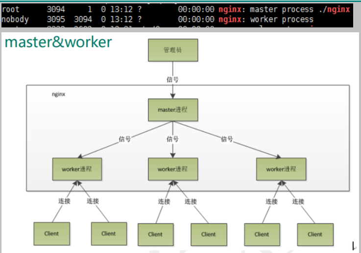

# 一、Nginx的简介

## 1.什么是nginx

Nginx 是高性能的 HTTP 和反向代理的服务器，处理高并发能力是十分强大的， 能经受高负 载的考验,有报告表明能支持高达 50,000 个并发连接数。

## 2.正向代理

通过客户端配置代理服务器进行指定网站访问

## 3.反向代理

暴露的是代理服务器地址，隐藏了真实服务器 IP 地址。

## 4.负载均衡

增加服务器的数量，然后将请求分发到各个服务器上，将原先请求集中到单个服务器上的 情况改为将请求分发到多个服务器上，将负载分发到不同的服务器，也就是我们所说的负载均衡

## 5.动静分离

## 6.高可用集群

# 二、Nginx原理

## 1.master&warker

## 2.worker是如何工作的

## 3、一个 master 和多个 woker 有好处

1. 可以使用 nginx –s reload 热部署，利用 nginx 进行热部署操作。

2. 每个 woker 是独立的进程，如果有其中的一个 woker 出现问题，其他 woker 独立的， 继续进行争抢，实现请求过程，不会造成服务中断。

