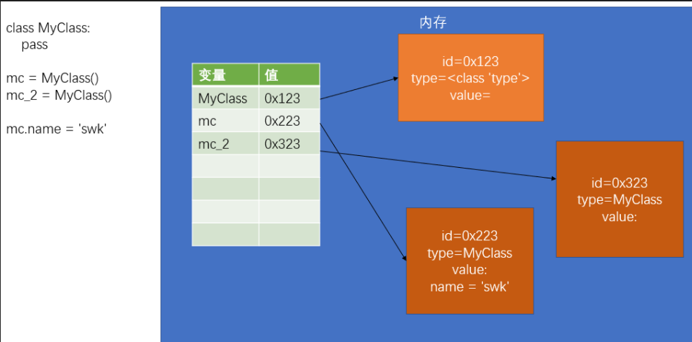
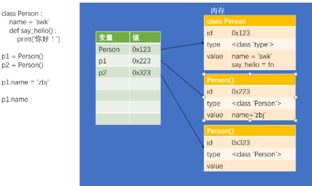

# 一、Python入门

## 1.基本语法

1. 在Python中严格区分大小写
2. Python中的每一行就是一条语句，每条语句以换行结束
3. Python中每一行语句不要过长（规范中建议每行不要超过80个字符）
4. 一条语句可以分多行编写，多行编写时语句后边以\结尾  
5. Python是缩进严格的语言，所以在Python中不要随便写缩进
6. 在Python中使用#来表示注释，#后的内容都属于注释

## 2.字面量和变量

* 字面量就是一个一个的值，比如：1，2，3，4，5，6，‘HELLO’，字面量所表示的意思就是它的字面的值，在程序中可以直接使用字面量

* 变量（variable）变量可以用来保存字面量，并且变量中保存的字面量是不定的，变量本身没有任何意思，它会根据不同的字面量表示不同的意思

## 3.数值

1. 整数
   * 在Python数值分成了三种：整数、浮点数（小数）、复数
   * 在Python中所有的整数都是int类型，整数的大小没有限制，可以是一无限大的整数
   * 如果数字的长度过大，可以使用下划线作为分隔符 c = 123_456_789
   * 二进制 0b开头，八进制，0o开头，十六进制 0x开头

2. 浮点数
   * 浮点数（小数），在Python中所有的小数都是float类型

3. 字符串

   * 在Python中字符串需要使用引号引起来 s = 'hello'

   * 相同的引号之间不能嵌套

   * 单引号和双引号不能跨行使用，三重引号可以换行，并且会保留字符串中的格式

   * 可以使用 \ 作为转义字符，通过转义字符，可以在字符串中使用一些特殊的内容

   * 如果将两个字符串进行相加，则会自动将两个字符串拼接为一个

   * 字符串不能和其他的类型进行加法运算

   * 在创建字符串时，可以在字符串中指定占位符

     %s 在字符串中表示任意字符

     %f 浮点数占位符

     %d 整数占位符

     ```python
     print("a = "+a)
     print('a =',a)
     b = 'Hello %s'%'孙悟空'
     b = 'hello %s 你好 %s'%('tom','孙悟空')
     b = 'hello %3.5s'%'abcdefg' # %3.5s字符串的长度限制在3-5之间
     b = 'hello %.2f'%123.456 # 123.46 保留2位小数
     print('a = %s'%a) # a的值填充%s
     ```

      

   * 格式化字符串

     * 格式化字符串，可以通过在字符串前添加一个f来创建一个格式化字符串

     * 在格式化字符串中可以直接嵌入变量

       ```python
       c = f'hello {a} {b}'
       print(f'a = {a}')
       # 创建一个变量来保存你的名字
       name = '孙悟空'
       
       # 使用四种方式来输出，欢迎 xxx 光临
       # 1.拼串
       print('欢迎 '+name+' 光临！')
       # 2。多个参数
       print('欢迎',name,'光临！')
       # 3.占位符
       print('欢迎 %s 光临！'%name)
       # 4.格式化字符串
       print(f'欢迎 {name} 光临！')
       ```

   * 复制字符串

     如果将字符串和数字相乘，则解释器会将字符串重复指定的次数并返回

4. 布尔值

   * 布尔值一共有两个 True 和 False

   * 布尔值实际上也属于整型，True就相当于1，False就相当于0
   * None（空值），None专门用来表示不存在

## 4.类型检查和转化

* type()用来检查值的类型

* 该函数会将检查的结果作为返回值返回，可以通过变量来接收函数的返回值

* 类型转换四个函数 int() float() str() bool()

* bool() 可以将对象转换为布尔值，任何对象都可以转换为布尔值

  规则：对于所有表示空性的对象都会转换为False，其余的转换为True，哪些表示的空性：0 、 None 、 '' 。。。

## 5. 可变对象

每个对象中都要保存三种数据

* id（标识）

​      \> id用来标识对象的唯一性，每一个对象都有唯一的id

​      \> 对象的id就相当于人的身份证号一样

​      \> 可以通过id()函数来查看对象的id

​      \> id是由解析器生成的，在CPython中，id就是对象的内存地址

​      \> 对象一旦创建，则它的id永远不能再改变

* type（类型）

​      \> 类型用来标识当前对象所属的类型

​      \> 比如：int str float bool 。。。

​      \> 类型决定了对象有哪些功能

​      \> 通过type()函数来查看对象的类型

​      \> Python是一门强类型的语言，对象一旦创建类型便不能修改

* value（值）

​      \> 值就是对象中存储的具体的数据

​      \> 对于有些对象值是可以改变的

​      \> 对象分成两大类，可变对象 不可变对象

​        	可变对象的值可以改变

​        	不可变对象的值不能改变，之前学习的对象都是不可变对象

## 6.运算符

1. 算术运算符

   \+ 加法运算符（如果是两个字符串之间进行加法运算，则会进行拼串操作）

   \- 减法运算符

   \* 乘法运算符（如果将字符串和数字相乘，则会对字符串进行复制操作，将字符串重复指定次数）

   / 除法运算符，运算时结果总会返回一个浮点类型

   // 整除，只会保留计算后的整数位，总会返回一个整型

   ** 幂运算，求一个值的几次幂

   % 取模，求两个数相除的余数

2. 关系运算符

   is 比较两个对象是否是同一个对象，比较的是对象的**id**

   is not 比较两个对象是否不是同一个对象，比较的是对象的**id**

3. 逻辑运算符

   not and or

   ```python
   # True and True
   result = 1 and 2 # 2
   # True and False
   result = 1 and 0 # 0
   # False and True
   result = 0 and 1 # 0
   # False and False
   result = 0 and None # 0
   
   # True or True
   result = 1 or 2 # 1
   # True or False
   result = 1 or 0 # 1
   # False or True
   result = 0 or 1 # 1
   # False or False
   result = 0 or None # None
   ```

4. 条件运算符

   语法： 语句1 if 条件表达式 else 语句2

   \#  执行流程：

   \#    条件运算符在执行时，会先对条件表达式进行求值判断

   \#    如果判断结果为True，则执行语句1，并返回执行结果

   \#    如果判断结果为False，则执行语句2，并返回执行结果

# 二、流程控制语句

## 1. 条件判断语句

​	a = input('请输入任意内容：')；程序会立即暂停，等待用户输入，返回一个字符串

* if语句

​		if 条件表达式 : 

​			代码块

* if-else语句 

​		if 条件表达式 :

​			代码块

​		else :

​			代码块

* if-elif-else语句

​		if 条件表达式 :

​			代码块

​		elif 条件表达式 :

​			代码块

​		elif 条件表达式 :

​			代码块

​		elif 条件表达式 :

​			代码块

​		else :

​			代码块

## 2. 循环语句

\#  while 条件表达式 :

\#      代码块

\#  else :

\#      代码块

# 三、序列

## 1. 序列

​	可变序列（序列中的元素可以改变）：

​      \> 列表（list）

​    不可变序列（序列中的元素不能改变）：

​      \> 字符串（str）   

​      \> 元组（tuple）

``` python
stus = ['孙悟空','猪八戒','沙和尚','唐僧','蜘蛛精','白骨精']
修改：stus[2] = '哈哈'
del stus[2] # 删除索引为2的元素
# 通过切片来修改列表
# 在给切片进行赋值时，只能使用序列
# stus[0:2] = ['牛魔王','红孩儿'] 使用新的元素替换旧元素
# stus[0:2] = ['牛魔王','红孩儿','二郎神']
# stus[0:0] = ['牛魔王'] # 向索引为0的位置插入元素
# 当设置了步长时，序列中元素的个数必须和切片中元素的个数一致
# stus[::2] = ['牛魔王','红孩儿','二郎神']

# 以上操作，只适用于可变序列
s = 'hello'
# s[1] = 'a' 不可变序列，无法通过索引来修改
# 可以通过 list() 函数将其他的序列转换为list
s = list(s)
```

## 2.字符串

| 获取长度:len                 | len函数可以获取字符串的长度。                                |
| ---------------------------- | ------------------------------------------------------------ |
| 查找内容:find()              | 查找指定内容在字符串中是否存在，如果存在就返回该内容在字符串中第一次出现的开始位置索引值，如果不存在，则返回-1. |
| 判断:startswith(),endswith() | 判断字符串是不是以谁谁谁开头/结尾                            |
| 计算出现次数:count()         | 返回 str在start和end之间 在 mystr里面出现的次数              |
| 替换内容:replace()           | 替换字符串中指定的内容，如果指定次数count，则替换不会超过count次。 |
| 切割字符串:split()           | 通过参数的内容切割字符串                                     |
| 修改大小写:upper(),lower()   | 将字符串中的大小写互换                                       |
| 空格处理:strip()             | 去空格                                                       |
| 字符串拼接:join()            | 字符串拼接                                                   |

## 3. 列表'[]'

* 创建列表，通过[]来创建列表

​		my_list = [10,20,30,40,50]

​		my_list[0]

* 切片

  切片是指对操作的对象截取其中一部分的操作。**字符串、列表、元组**都支持切片操作。

  语法：1. 列表[起始:结束]   2. 语法：列表[起始:结束:步长]   步长表示，每次获取元素的间隔，默认值是1。不能是0，但是可以是负数，负数就从后面取。

  \#  通过切片获取元素时，会包括起始位置的元素，不会包括结束位置的元素

  \#  做切片操作时，总会返回一个新的列表，不会影响原来的列表

  \#  起始和结束位置的索引都可以省略不写

  \#  如果省略结束位置，则会一直截取到最后

  \#  如果省略起始位置，则会从第一个元素开始截取

  \#  如果起始位置和结束位置全部省略，则相当于创建了一个列表的副本

* 通用操作

  1. 添加元素

     * append() 在末尾添加元素
     * insert(index, object)    在指定位置插入元素
     * extend() 合并两个列表  

  2. 修改元素  

     我们是通过指定下标来访问列表元素，因此修改元素的时候，为指定的列表下标赋值即可。  

     a[i]="ss";

  3. 查找元素  

     * in（存在）,如果存在那么结果为true，否则为false
     * not in（不存在），如果不存在那么结果为true，否则false  

  4. 删除元素  

     * del：根据下标进行删除
     * pop：删除最后一个元素
     * remove：根据元素的值进行删除  

  1. +可以将两个列表拼接为一个列表

  2. \* 可以将列表重复指定的次数

  3. in用来检查指定元素是否存在于列表中，如果存在，返回True，否则返回False

  4. not in用来检查指定元素是否不在列表中，如果不在，返回True，否则返回False

  5. len()获取列表中的元素的个数

  6. min() 获取列表中的最小值

  7. max() 获取列表中的最大值

  8. s.index("元素") 获取指定元素在列表中的第一次出现时索引。第二个参数，表示查找的起始位置 ， 第三个参数，表示查找的结束位置，第二第三可选

  9. s.count() 统计指定元素在列表中出现的次数

  10. append() 向列表的最后添加一个元素

  11. insert() 向列表的指定位置插入一个元素 stus.insert(2,'唐僧')

  12. extend()  需要一个序列作为参数，它会将该序列中的元素添加到当前列表中 stus.extend(['唐僧','白骨精'])

  13. clear() 清空序列

  14. pop() 根据索引删除并返回被删除的元素 stus.pop(2)  无参数删除最后一个

  15. remove() 删除指定值得元素，如果相同值得元素有多个，只会删除第一个 stus.remove('猪八戒')

  16. reverse() 用来反转列表  stus.reverse()

  17. sort() 用来对列表中的元素进行排序，默认是升序排列，如果需要降序排列，则需要传递一个reverse=True作为参数

  18. range()是一个函数，可以用来生成一个自然数的序列

      ``` python
      r = range(5) # 生成一个这样的序列[0,1,2,3,4]
      r = range(0,10,2)
      r = range(10,0,-1)
      # 该函数需要三个参数
      #  1.起始位置（可以省略，默认是0）
      #  2.结束位置
      #  3.步长（可以省略，默认是1）
      ```

* 列表遍历

  ```python
  # 通过while循环来遍历列表
  i = 0
  while i < len(stus):
      print(stus[i])
      i += 1
  
  # 通过for循环来遍历列表
  # 语法：
  #   for 变量 in 序列 :
  #       代码块
  # for循环的代码块会执行多次，序列中有几个元素就会执行几次
  #   没执行一次就会将序列中的一个元素赋值给变量，
  #   所以我们可以通过变量，来获取列表中的元素
  for s in stus :
      print(s)
  ```

  

## 4. 元组'()'

Python的元组与列表类似，不同之处在于**元组的元素不能修改**。元组使用小括号，列表使用方括号。

my_tuple = (1,2,3,4,5) # 创建了一个5个元素的元组

\# 元组是不可变对象，不能尝试为元组中的元素重新赋值

\# 当元组不是空元组时，括号可以省略

\# 如果元组不是空元组，它里边至少要有一个,

my_tuple = 10,20,30,40     my_tuple = 40, # 一个元素要加，不然认为是int

\# 元组的解包（解构）

\# 解包指就是将元组当中每一个元素都赋值给一个变量

a,b,c,d = my_tuple # abcd分别为元组里的一个数字

a , b = b , a # 交换两个数值

``` python
# 在对一个元组进行解包时，变量的数量必须和元组中的元素的数量一致
# 也可以在变量前边添加一个*，这样变量将会获取元组中所有剩余的元素
a , b , *c = my_tuple
a , *b , c = my_tuple
*a , b , c = my_tuple
a , b , *c = [1,2,3,4,5,6,7]
a , b , *c = 'hello world' a==h,b==e
# 不能同时出现两个或以上的*变量
# *a , *b , c = my_tuple SyntaxError: two starred expressions in assignment
print('a =',a)
print('b =',b)
print('c =',c)

a = [1,2,3]
b = [1,2,3]
print(a,b) #地址不同
print(id(a),id(b))
print(a == b) # a和b的值相等，使用==会返回True
print(a is b) # a和b不是同一个对象，内存地址不同，使用is会返回False
```

## 5. 字典'{}'

``` python
# 使用 {} 来创建字典
d = {} # 创建了一个空字典

# 创建一个保护有数据的字典
# 语法：
#   {key:value,key:value,key:value}
#   字典的值可以是任意对象
#   字典的键可以是任意的不可变对象（int、str、bool、tuple ...），但是一般我们都会使用str
#       字典的键是不能重复的，如果出现重复的后边的会替换到前边的
# d = {'name':'孙悟空' , 'age':18 , 'gender':'男' , 'name':'sunwukong'}
```

1. 创建字典
   * {}         d = {'name':'孙悟空' , 'age':18 , 'gender':'男' , 'name':'sunwukong'}
   * dict()   d = dict(name='孙悟空',age=18,gender='男') 

2. 字典操作

   * len() 获取字典中键值对的个数

   * in 检查字典中是否包含指定的键

   * not in 检查字典中是否不包含指定的键

   * get(key[, default]) 该方法用来根据键来获取字典中的值

   * d[key] = value 如果key存在则覆盖，不存在则添加

   * setdefault(key[, default]) 可以用来向字典中添加key-value

     \#  如果key已经存在于字典中，则返回key的值，不会对字典做任何操作

     \#  如果key不存在，则向字典中添加这个key，并设置value

   * update([other])   # d.update(d2)

     \# 将其他的字典中的key-value添加到当前字典中

     \# 如果有重复的key，则后边的会替换到当前的

   * 删除，可以使用 del 来删除字典中的 key-value            del d['a']

   * popitem()  \# 随机删除字典中的一个键值对，一般都会删除最后一个键值对

   * pop(key[, default])  # 根据key删除字典中的key-value  #将被删除的value返回,没有则返回默认值，没有则报错。

   * clear() #清空字典

   * copy()  \# 该方法用于对字典进行浅复制

     \# 复制以后的对象，和原对象是独立，修改一个不会影响另一个

     \# 注意，浅复制会简单复制对象内部的值，如果值也是一个可变对象，这个可变对象不会被复制

3. 字典遍历

   * keys()

     通过遍历keys()来获取所有的键

     ```python
     for k in d.keys() :
         print(k , d[k])
     ```

   * values()

     该方法会返回一个序列，序列中保存有字典的左右的值

     ``` python
     for v in d.values():
         print(v)
     ```

   * items()

     该方法会返回字典中所有的项

     它会返回一个序列，序列中包含有双值子序列,双值分别是，字典中的key和value

     ``` python
     for k,v in d.items() :
         print(k , '=' , v)
     ```

## 6. 集合'{}'

* 集合中只能存储不可变对象
* 集合中存储的对象是无序（不是按照元素的插入顺序保存）
* 集合中不能出现重复的元素

1. 基本操作

   ``` python
   # 使用 {} 来创建集合
   s = {10,3,5,1,2,1,2,3,1,1,1,1} # <class 'set'>
   s = {"aaa"}
   # 使用 set() 函数来创建集合
   s = set() # 空集合 s={}空字典
   # 可以通过set()来将序列和字典转换为集合
   s = set([1,2,3,4,5,1,1,2,3,4,5])
   s = set({'a':1,'b':2,'c':3}) # 使用set()将字典转换为集合时，只会包含字典中的键
   # 使用in和not in来检查集合中的元素
   # 使用len()来获取集合中元素的数量
   # add() 向集合中添加元素
   s.add(10)
   # update() 将一个集合中的元素添加到当前集合中
   # update()可以传递序列或字典作为参数，字典只会使用键
   s2 = set('hello')
   s.update(s2)
   s.update((10,20,30,40,50))
   s.update({10:'ab',20:'bc',100:'cd',1000:'ef'})
   # pop()随机删除并返回一个集合中的元素
   # result = s.pop()
   # remove()删除集合中的指定元素
   # clear()清空集合
   # copy()对集合进行浅复制
   ```

2. 集合的运算

   ``` python
   # & 交集运算
   result = s & s2 # {3, 4, 5}
   # | 并集运算
   result = s | s2 # {1,2,3,4,5,6,7}
   # - 差集
   result = s - s2 # {1, 2}
   # ^ 异或集 获取只在一个集合中出现的元素
   result = s ^ s2 # {1, 2, 6, 7}
   # <= 检查一个集合是否是另一个集合的子集
   # 如果a集合中的元素全部都在b集合中出现，那么a集合就是b集合的子集，b集合是a集合超集
   a = {1,2,3}
   b = {1,2,3,4,5}
   result = a <= b # True
   result = {1,2,3,4,5} <= {1,2,3} # False
   # < 检查一个集合是否是另一个集合的真子集
   # 如果超集b中含有子集a中所有元素，并且b中还有a中没有的元素，则b就是a的真超集，a是b的真子集
   result = {1,2,3} < {1,2,3} # False
   result = {1,2,3} < {1,2,3,4,5} # True
   # >= 检查一个集合是否是另一个的超集
   # > 检查一个集合是否是另一个的真超集
   print('result =',result)
   ```

# 四、函数

 def 函数名([形参1,形参2,...形参n]) :

​      代码块

## 1.参数

``` python
# 定义函数时指定形参
def fn2(a , b) :
    print(a,"+",b,"=",a + b)
# 调用函数时，来传递实参
fn2(10,20)
```

``` python
# 定义形参时，可以为形参指定默认值
# 指定了默认值以后，如果用户传递了参数则默认值没有任何作用
# 如果用户没有传递，则默认值就会生效
def fn(a = 5 , b = 10 , c = 20):
    print('a =',a)
```

``` python
# 位置参数就是将对应位置的实参复制给对应位置的形参
# 第一个实参赋值给第一个形参，第二个实参赋值给第二个形参 。。。
# fn(1 , 2 , 3)

# 关键字参数，可以不按照形参定义的顺序去传递，而直接根据参数名去传递参数
# fn(b=1 , c=2 , a=3)
# 位置参数和关键字参数可以混合使用
# 混合使用关键字和位置参数时，必须将位置参数写到前面
# fn(1,c=30)
```

## 2.不定长参数

```python
# 定义一个函数，可以求任意个数字的和
def sum(*nums):
    result = 0
    for n in nums :
        result += n
    print(result)
# sum(123,456,789,10,20,30,40)
# 在定义函数时，可以在形参前边加上一个*，这样这个形参将会获取到所有的实参
# 它将会将所有的实参保存到一个元组中

# *a会接受所有的位置实参，并且会将这些实参统一保存到一个元组中（装包）

# 带星号的形参只能有一个
# 第一个参数给a，第二个参数给b，剩下的都保存到c的元组中
# def fn2(a,b,*c):
#     print('a =',a)
#     print('b =',b)
#     print('c =',c)

# 可变参数不是必须写在最后，但是注意，带*的参数后的所有参数，必须以关键字参数的形式传递
# 第一个参数给a，剩下的位置参数给b的元组，c必须使用关键字参数
# def fn2(a,*b,c):
#     print('a =',a)
#     print('b =',b)
#     print('c =',c)

# 如果在形参的开头直接写一个*,则要求我们的所有的参数必须以关键字参数的形式传递
def fn2(*,a,b,c):
    print('a =',a)
    print('b =',b)
    print('c =',c)
# fn2(a=3,b=4,c=5)

# *形参只能接收位置参数，而不能接收关键字参数
# def fn3(*a) :
#     print('a =',a)

# **形参可以接收其他的关键字参数，它会将这些参数统一保存到一个字典中
#   字典的key就是参数的名字，字典的value就是参数的值
# **形参只能有一个，并且必须写在所有参数的最后
def fn3(b,c,**a) :
    print('a =',a,type(a))
    print('b =',b)
    print('c =',c)

# fn3(b=1,d=2,c=3,e=10,f=20)

# 参数的解包（拆包）
def fn4(a,b,c):
    print('a =',a)
    print('b =',b)
    print('c =',c)

# 创建一个元组
t = (10,20,30)

# 传递实参时，也可以在序列类型的参数前添加星号，这样他会自动将序列中的元素依次作为参数传递
# 这里要求序列中元素的个数必须和形参的个数的一致
# fn4(*t)    

# 创建一个字典
d = {'a':100,'b':200,'c':300}
# 通过 **来对一个字典进行解包操作
fn4(**d)
```

## 3.返回值

```python
# 返回值，返回值就是函数执行以后返回的结果
# 可以通过 return 来指定函数的返回值
# 可以之间使用函数的返回值，也可以通过一个变量来接收函数的返回值
# 如果仅仅写一个return 或者 不写return，则相当于return None 
```

## 4.文档字符串

1. help()是Python中的内置函数

​	通过help()函数可以查询python中的函数的用法

​	语法：help(函数对象)

​	help(print) # 获取print()函数的使用说明

2. 文档字符串（doc str）

​	在定义函数时，可以在函数内部编写文档字符串，文档字符串就是函数的说明

​	当我们编写了文档字符串时，就可以通过help()函数来查看函数的说明

​	文档字符串非常简单，其实直接在函数的第一行写一个字符串就是文档字符串

```python
def fn(a:int,b:bool,c:str='hello') -> int://描述型
    '''
    这是一个文档字符串的示例
    函数的作用：。。。。。
    函数的参数：
        a，作用，类型，默认值。。。。
        b，作用，类型，默认值。。。。
        c，作用，类型，默认值。。。。
    '''
    return 10

help(fn)
```

## 5.作用域与命名空间

1. 作用域（scope）

``` python
# 作用域指的是变量生效的区域
#  全局作用域
#   - 全局作用域在程序执行时创建，在程序执行结束时销毁
#   - 所有函数以外的区域都是全局作用域
#   - 在全局作用域中定义的变量，都属于全局变量，全局变量可以在程序的任意位置被访问
#   
#  函数作用域
#   - 函数作用域在函数调用时创建，在调用结束时销毁
#   - 函数每调用一次就会产生一个新的函数作用域
#   - 在函数作用域中定义的变量，都是局部变量，它只能在函数内部被访问
# 变量的查找
#   - 当我们使用变量时，会优先在当前作用域中寻找该变量，如果有则使用，
#       如果没有则继续去上一级作用域中寻找，如果有则使用，
#       如果依然没有则继续去上一级作用域中寻找，以此类推
#       直到找到全局作用域，依然没有找到，则会抛出异常

a = 20
def fn3():
    # a = 10 # 在函数中为变量赋值时，默认都是为局部变量赋值
    # 如果希望在函数内部修改全局变量，则需要使用global关键字，来声明变量
    global a # 声明在函数内部的使用a是全局变量，此时再去修改a时，就是在修改全局的a
    a = 10 # 修改全局变量
    print('函数内部：','a =',a)
```

2. 命名空间

``` python
# 命名空间指的是变量存储的位置，每一个变量都需要存储到指定的命名空间当中
# 每一个作用域都会有一个它对应的命名空间
# 全局命名空间，用来保存全局变量。函数命名空间用来保存函数中的变量
# 命名空间实际上就是一个字典，是一个专门用来存储变量的字典

locals()用来获取当前作用域的命名空间
scope = locals() # 当前命名空间
print(type(scope))
# print(a)==print(scope['a'])
# 向scope中添加一个key-value
scope['c'] = 1000 # 向字典中添加key-value就相当于在全局中创建了一个变量（一般不建议这么做）
# print(c)

globals() 函数可以用来在任意位置获取全局命名空间
global_scope = globals()
# print(global_scope['a'])
global_scope['a'] = 30
# print(scope)
```

## 6.高阶函数

接收函数作为参数，或者将函数作为返回值的函数是高阶函数当我们使用一个函数作为参数时，实际上是将指定的代码传递进了目标函数

1. filter()可以从序列中过滤出符合条件的元素，保存到一个新的序列中

   参数：

   1.函数，根据该函数来过滤序列（可迭代的结构）

   2.需要过滤的序列（可迭代的结构）

   返回值：过滤后的新序列（可迭代的结构）

2. 匿名函数 lambda 函数表达式 

   lambda函数表达式专门用来创建一些简单的函数，他是函数创建的又一种方式

   语法：lambda 参数列表 : 返回值

   匿名函数一般都是作为参数使用，其他地方一般不会使用

   ```python
   def fn5(a , b):
       return a + b
   # (lambda a,b : a + b)(10,20)
   # 也可以将匿名函数赋值给一个变量，一般不会这么做
   fn6 = lambda a,b : a + b//fn5一样
   r = filter(lambda i : i > 5 , l)
   
   ```

3. map()

   map()函数可以对可跌倒对象中的所有元素做指定的操作，然后将其添加到一个新的对象中返回

   ```python
   l = [1,2,3,4,5,6,7,8,9,10]
   r = map(lambda i : i ** 2 , l)
   ```

4. sort()

   该方法用来对列表中的元素进行排序

   ```python
   #   在sort()可以接收一个关键字参数 ， key
   #   key需要一个函数作为参数，当设置了函数作为参数
   #   每次都会以列表中的一个元素作为参数来调用函数，并且使用函数的返回值来比较元素的大小
   l = ['bb','aaaa','c','ddddddddd','fff']
   l.sort(key=len)
   
   l = [2,5,'1',3,'6','4']
   l.sort(key=int)
   ```

5. sorted()

   这个函数和sort()的用法基本一致，sort()只能对列表排序，但是sorted()可以对任意的序列进行排序

   并且使用sorted()排序不会影响原来的对象，而是返回一个新对象

   ```python
   l = [2,5,'1',3,'6','4']
   print('排序前:',l)
   print(sorted(l,key=int))
   print('排序后:',l)
   ```

## 7.闭包

\# 将函数作为返回值返回，也是一种高阶函数

\# 这种高阶函数我们也称为叫做闭包，通过闭包可以创建一些只有当前函数能访问的变量

\#  可以将一些私有的数据藏到的闭包中

## 8.装饰器

```python
111111111
def begin_end(old):
    '''
        用来对其他函数进行扩展，使其他函数可以在执行前打印开始执行，执行后打印执行结束
        参数：
            old 要扩展的函数对象
    '''
    # 创建一个新函数
    def new_function(*args , **kwargs):
        print('开始执行~~~~')
        # 调用被扩展的函数
        result = old(*args , **kwargs)
        print('执行结束~~~~')
        # 返回函数的执行结果
        return result

    # 返回新函数        
    return new_function

f = begin_end(fn)
f2 = begin_end(add)
f3 = begin_end(mul)
22222222222222222
# 向begin_end()这种函数我们就称它为装饰器
#   通过装饰器，可以在不修改原来函数的情况下来对函数进行扩展
#   在开发中，我们都是通过装饰器来扩展函数的功能的
# 在定义函数时，可以通过@装饰器，来使用指定的装饰器，来装饰当前的函数
#   可以同时为一个函数指定多个装饰器，这样函数将会安装从内向外的顺序被装饰 
def fn3(old):
    '''
        用来对其他函数进行扩展，使其他函数可以在执行前打印开始执行，执行后打印执行结束
        参数：
            old 要扩展的函数对象
    '''
    # 创建一个新函数
    def new_function(*args , **kwargs):
        print('fn3装饰~开始执行~~~~')
        # 调用被扩展的函数
        result = old(*args , **kwargs)
        print('fn3装饰~执行结束~~~~')
        # 返回函数的执行结果
        return result
    # 返回新函数        
    return new_function
33333333333333333
@fn3		//后装饰
@begin_end  //装饰器，先装饰
def say_hello():
    print('大家好~~~')
say_hello()
```

# 五、对象

## 1.类

  int() float() bool() str() list() dict() .... 这些都是类

  a = int(10) # 创建一个int类的实例 等价于 a = 10

  我们自定义的类都需要使用大写字母开头，使用大驼峰命名法（帕斯卡命名法）来对类命名

1. 类的定义

   ```python
   class 类名([父类]):
    代码块
   <class '__main__.MyClass'>
   class MyClass():
       pass
   
   mc=MyClass() //类创建对象
   isinstance()用来检查一个对象是否是一个类的实例
   result = isinstance(mc,MyClass)
   ```

   类也是一个对象！

   类就是一个用来创建对象的对象！

   类是type类型的对象，定义类实际上就是定义了一个type类型的对象

   

``` python
class Person :
    # 在类的代码块中，我们可以定义变量和函数
    # 在类中我们所定义的变量，将会成为所有的实例的公共属性
    # 所有实例都可以访问这些变量
    name = 'swk' # 公共属性，所有实例都可以访问

    # 在类中也可以定义函数，类中的定义的函数，我们称为方法
    # 这些方法可以通过该类的所有实例来访问
    
    def say_hello(self) :
        # 方法每次被调用时，解析器都会自动传递第一个实参
        # 第一个参数，就是调用方法的对象本身，
        #   如果是p1调的，则第一个参数就是p1对象
        #   如果是p2调的，则第一个参数就是p2对象
        # 一般我们都会将这个参数命名为self

        # say_hello()这个方法，可以显示如下格式的数据：
        #   你好！我是 xxx
        #   在方法中不能直接访问类中的属性
        print('你好！我是 %s' %self.name)
        
# 方法调用和函数调用的区别
# 如果是函数调用，则调用时传几个参数，就会有几个实参
# 但是如果是方法调用，默认传递一个参数，所以方法中至少要定义一个形参
```

​		 类对象和实例对象中都可以保存属性（方法）

​      \- 如果这个属性（方法）是所有的实例共享的，则应该将其保存到类对象中

​      \- 如果这个属性（方法）是某个实例独有，则应该保存到实例对象中   

​      \- 一般情况下，属性保存到实例对象中，而方法需要保存到类对象中   



2. 对象初始化

   ```python
   class Person :
       # 在类中可以定义一些特殊方法（魔术方法）
       # 特殊方法都是以__开头，__结尾的方法
       # 特殊方法不需要我们自己调用，不要尝试去调用特殊方法
       # 特殊方法将会在特殊的时刻自动调用
       # 创建对象的流程
       # p1 = Person()的运行流程
       #   1.创建一个变量
       #   2.在内存中创建一个新对象
       #   3.执行类的代码块中的代码（只在类定义的时候定义一次），类对象中
       #   4.__init__(self)方法执行，实例对象中
       #   5.将对象的id赋值给变量
   
       # init会在对象创建以后离开执行
       # init可以用来向新创建的对象中初始化属性
       # 调用类创建对象时，类后边的所有参数都会依次传递到init()中
       def __init__(self,name):
           # print(self)
           # 通过self向新建的对象中初始化属性
           self.name = name
   
       def say_hello(self):
           print('大家好，我是%s'%self.name)
   
   # 目前来讲，对于Person类来说name是必须的，并且每一个对象中的name属性基本上都是不同
   # 我们希望，在创建对象时，必须设置name属性，如果不设置对象将无法创建
   # 并且属性的创建应该是自动完成的，而不是在创建对象以后手动完成
   1：
   # p1 = Person()
   # # 手动向对象添加name属性
   # p1.name = '孙悟空'
   2：
   p1 = Person('孙悟空')
   # p1.__init__() 不要这么做
   ```
   
3. **类的基本结构**  
   

  class 类名([父类]) :

​    公共的属性... 

​    \# 对象的初始化方法

​    def __init__(self,...):

​      ...

​    \# 其他的方法   

​    def method_1(self,...):

​      ...

​    def method_2(self,...):

​      ...

​    ... 

## 2.封装

```python
# 封装是面向对象的三大特性之一
# 封装指的是隐藏对象中一些不希望被外部所访问到的属性或方法
# 如何隐藏一个对象中的属性？
#   - 将对象的属性名，修改为一个外部不知道的名字
# 如何获取（修改）对象中的属性？
#   - 需要提供一个getter和setter方法使外部可以访问到属性
#   - getter 获取对象中的指定属性（get_属性名）
#   - setter 用来设置对象的指定属性（set_属性名）
# 使用封装，确实增加了类的定义的复杂程度，但是它也确保了数据的安全性
#   1.隐藏了属性名，使调用者无法随意的修改对象中的属性
#   2.增加了getter和setter方法，很好的控制的属性是否是只读的
#       如果希望属性是只读的，则可以直接去掉setter方法
#       如果希望属性不能被外部访问，则可以直接去掉getter方法
#   3.使用setter方法设置属性，可以增加数据的验证，确保数据的值是正确的
#   4.使用getter方法获取属性，使用setter方法设置属性
#       可以在读取属性和修改属性的同时做一些其他的处理
#   5.使用getter方法可以表示一些计算的属性
class Dog:
    '''
        表示狗的类
    '''
    def __init__(self , name , age):
        self.hidden_name = name
        self.hidden_age = age
    def say_hello(self):
        print('大家好，我是 %s'%self.hidden_name) 
    def get_name(self):
        '''
            get_name()用来获取对象的name属性
        '''    
        # print('用户读取了属性')
        return self.hidden_name
    def set_name(self , name):
        # print('用户修改了属性')
        self.hidden_name = name
    def get_age(self):
        return self.hidden_age
    def set_age(self , age):
        if age > 0 :
            self.hidden_age = age    
d = Dog('旺财',8)
# 调用setter来修改name属性 
d.set_name('小黑')
d.set_age(-10)
# d.say_hello()
print(d.get_age())
```

```python
# 可以为对象的属性使用双下划线开头，__xxx
# 双下划线开头的属性，是对象的隐藏属性，隐藏属性只能在类的内部访问，无法通过对象访问
# 其实隐藏属性只不过是Python自动为属性改了一个名字
# 实际上是将名字修改为了，_类名__属性名 比如 __name -> _Person__name
```
```python
# 使用__开头的属性，实际上依然可以在外部访问，所以这种方式我们一般不用
#   一般我们会将一些私有属性（不希望被外部访问的属性）以_开头
#   一般情况下，使用_开头的属性都是私有属性，没有特殊需要不要修改私有属性
#   _开头也可以改
```

```python
class Person:
    def __init__(self,name,age):
        self._name = name
        self._age = age
    # property装饰器，用来将一个get方法，转换为对象的属性
    # 添加为property装饰器以后，我们就可以像调用属性一样使用get方法
    # 使用property装饰的方法，必须和属性名是一样的
    @property    
    def name(self):
        print('get方法执行了~~~')
        return self._name

    # setter方法的装饰器：@属性名.setter
    @name.setter    
    def name(self , name):
        print('setter方法调用了')
        self._name = name        

    @property
    def age(self):
        return self._age

    @age.setter    
    def age(self , age):
        self._age = age   

p = Person('猪八戒',18)
p.name = '孙悟空' //实际是调用name()方法
p.age = 28
print(p.name,p.age)
```

## 3.继承

1. 继承

```python
class Dog(Animal):
# 有一个类，能够实现我们需要的大部分功能，但是不能实现全部功能
# 如何能让这个类来实现全部的功能呢？
#   ① 直接修改这个类，在这个类中添加我们需要的功能
#       - 修改起来会比较麻烦，并且会违反OCP原则
#   ② 直接创建一个新的类
#       - 创建一个新的类比较麻烦，并且需要大量的进行复制粘贴，会出现大量的重复性代码
#   ③ 直接从Animal类中来继承它的属性和方法
#       - 继承是面向对象三大特性之一
#       - 通过继承我们可以使一个类获取到其他类中的属性和方法
#       - 在定义类时，可以在类名后的括号中指定当前类的父类（超类、基类、super）
#           子类（衍生类）可以直接继承父类中的所有的属性和方法
#           
#  通过继承可以直接让子类获取到父类的方法或属性，避免编写重复性的代码，并且也符合OCP原则
#   所以我们经常需要通过继承来对一个类进行扩展

# 在创建类时，如果省略了父类，则默认父类为object
#   object是所有类的父类，所有类都继承自object

# isinstance()用来检查一个对象是否是一个类的实例
#   如果这个类是这个对象的父类，也会返回True
#   所有的对象都是object的实例
```

2. 重写

```python
# 当我们调用一个对象的方法时，
#   会优先去当前对象中寻找是否具有该方法，如果有则直接调用
#   如果没有，则去当前对象的父类中寻找，如果父类中有则直接调用父类中的方法，
#   如果没有，则去父类的父类中寻找，以此类推，直到找到object，如果依然没有找到，则报错
```

3. puper()

```python
# 父类中的所有方法都会被子类继承，包括特殊方法，也可以重写特殊方法
# 希望可以直接调用父类的__init__来初始化父类中定义的属性
# super() 可以用来获取当前类的父类，
# 并且通过super()返回对象调用父类方法时，不需要传递self
```

4. 多重继承

```python
# 在Python中是支持多重继承的，也就是我们可以为一个类同时指定多个父类
#   可以在类名的()后边添加多个类，来实现多重继承
#   多重继承，会使子类同时拥有多个父类，并且会获取到所有父类中的方法
# 在开发中没有特殊的情况，应该尽量避免使用多重继承，因为多重继承会让我们的代码过于复杂
# 如果多个父类中有同名的方法，则会现在第一个父类中寻找，然后找第二个，然后找第三个。。。
#   前边父类的方法会覆盖后边父类的方法

# 类名.__bases__ 这个属性可以用来获取当前类的所有父类    
```

## 4.多态

```python
# 定义一个函数
# 对于say_hello()这个函数来说，只要对象中含有name属性，它就可以作为参数传递
#   这个函数并不会考虑对象的类型，只要有name属性即可

# 面向对象的三大特征：
#   封装
#       - 确保对象中的数据安全
#   继承
#       - 保证了对象的可扩展性
#   多态
#       - 保证了程序的灵活性
```

## 5.类属性和方法

```python
# 定义一个类
class A(object):

    # 类属性
    # 实例属性
    # 类方法
    # 实例方法
    # 静态方法

    # 类属性，直接在类中定义的属性是类属性
    #   类属性可以通过类或类的实例访问到
    #   但是类属性只能通过类对象来修改，无法通过实例对象修改
    count = 0

    #实例属性
    def __init__(self):
        # 实例属性，通过实例对象添加的属性属于实例属性
        #   实例属性只能通过实例对象来访问和修改，类对象无法访问修改
        self.name = '孙悟空'

    # 实例方法
    #   在类中定义，以self为第一个参数的方法都是实例方法
    #   实例方法在调用时，Python会将调用对象作为self传入  
    #   实例方法可以通过实例和类去调用
    #       当通过实例调用时，会自动将当前调用对象作为self传入
    #       当通过类调用时，不会自动传递self，此时我们必须手动传递self
    def test(self):
        print('这是test方法~~~ ' , self)    

    # 类方法    
    # 在类内部使用 @classmethod 来修饰的方法属于类方法
    # 类方法的第一个参数是cls，也会被自动传递，cls就是当前的类对象
    #   类方法和实例方法的区别，实例方法的第一个参数是self，而类方法的第一个参数是cls
    #   类方法可以通过类去调用，也可以通过实例调用，没有区别
    @classmethod
    def test_2(cls):
        print('这是test_2方法，他是一个类方法~~~ ',cls)
        print(cls.count)

    # 静态方法
    # 在类中使用 @staticmethod 来修饰的方法属于静态方法  
    # 静态方法不需要指定任何的默认参数，静态方法可以通过类和实例去调用  
    # 静态方法，基本上是一个和当前类无关的方法，它只是一个保存到当前类中的函数
    # 静态方法一般都是一些工具方法，和当前类无关
    @staticmethod
    def test_3():
        print('test_3执行了~~~')

a = A()
# 实例属性，通过实例对象添加的属性属于实例属性
# a.count = 10
# A.count = 100
# print('A ,',A.count) 
# print('a ,',a.count) 
# print('A ,',A.name) 
# print('a ,',a.name)   

# a.test() 等价于 A.test(a)
# A.test_2() 等价于 a.test_2()

A.test_3()
a.test_3()
```

## 6.垃圾回收

```python
# 在程序中没有被引用的对象就是垃圾，这种垃圾对象过多以后会影响到程序的运行的性能
#   所以我们必须进行及时的垃圾回收，所谓的垃圾回收就是讲垃圾对象从内存中删除
# 在Python中有自动的垃圾回收机制，它会自动将这些没有被引用的对象删除，
#   所以我们不用手动处理垃圾回收
class A:
    def __init__(self):
        self.name = 'A类'
    # del是一个特殊方法，它会在对象被垃圾回收前调用
    def __del__(self):
        print('A()对象被删除了~~~',self)
a = A()
b = a # 又使用一个变量b，来引用a对应的对象
```

## 7.特殊方法

```python
# 特殊方法，也称为魔术方法
# 特殊方法都是使用__开头和结尾的
# 特殊方法一般不需要我们手动调用，需要在一些特殊情况下自动执行

# 定义一个Person类
class Person(object):
    """人类"""
    def __init__(self, name , age):
        self.name = name
        self.age = age

    # __str__（）这个特殊方法会在尝试将对象转换为字符串的时候调用
    # 它的作用可以用来指定对象转换为字符串的结果  （print函数）  
    def __str__(self):
        return 'Person [name=%s , age=%d]'%(self.name,self.age)        

    # __repr__()这个特殊方法会在对当前对象使用repr()函数时调用
    # 它的作用是指定对象在 ‘交互模式’中直接输出的效果    
    def __repr__(self):
        return 'Hello'        

    # object.__add__(self, other)
    # object.__sub__(self, other)
    # object.__mul__(self, other)
    # object.__matmul__(self, other)
    # object.__truediv__(self, other)
    # object.__floordiv__(self, other)
    # object.__mod__(self, other)
    # object.__divmod__(self, other)
    # object.__pow__(self, other[, modulo])
    # object.__lshift__(self, other)
    # object.__rshift__(self, other)
    # object.__and__(self, other)
    # object.__xor__(self, other)
    # object.__or__(self, other)

    # object.__lt__(self, other) 小于 <
    # object.__le__(self, other) 小于等于 <=
    # object.__eq__(self, other) 等于 ==
    # object.__ne__(self, other) 不等于 !=
    # object.__gt__(self, other) 大于 >
    # object.__ge__(self, other) 大于等于 >= 
    
    # __len__()获取对象的长度

    # object.__bool__(self)
    # 可以通过bool来指定对象转换为布尔值的情况
    def __bool__(self):
        return self.age > 17

    # __gt__会在对象做大于比较的时候调用，该方法的返回值将会作为比较的结果
    # 他需要两个参数，一个self表示当前对象，other表示和当前对象比较的对象
    # self > other
    def __gt__(self , other):
        return self.age > other.age

# 创建两个Person类的实例        
p1 = Person('孙悟空',18)
p2 = Person('猪八戒',28)

# 打印p1
# 当我们打印一个对象时，实际上打印的是对象的中特殊方法 __str__()的返回值
# print(p1) # <__main__.Person object at 0x04E95090>
# print(p1)
# print(p2)

# print(repr(p1))

# t = 1,2,3
# print(t) # (1, 2, 3)

# print(p1 > p2)
# print(p2 > p1)

# print(bool(p1))

# if p1 :
#     print(p1.name,'已经成年了')
# else :
#     print(p1.name,'还未成年了')
```

## 8.模块

```python
# 模块化，模块化指将一个完整的程序分解为一个一个小的模块
#   通过将模块组合，来搭建出一个完整的程序
# 不采用模块化，统一将所有的代码编写到一个文件中
# 采用模块化，将程序分别编写到多个文件中
#   模块化的有点：
#       ① 方便开发
#       ② 方便维护
#       ③ 模块可以复用！

# 在Python中一个py文件就是一个模块，要想创建模块，实际上就是创建一个python文件
# 注意：模块名要符号标识符的规范

# 在一个模块中引入外部模块
# ① import 模块名 （模块名，就是python文件的名字，注意不要py）
# ② import 模块名 as 模块别名
#   - 可以引入同一个模块多次，但是模块的实例只会创建一个
#   - import可以在程序的任意位置调用，但是一般情况下，import语句都会统一写在程序的开头
#   - 在每一个模块内部都有一个__name__属性，通过这个属性可以获取到模块的名字
#   - __name__属性值为 __main__的模块是主模块，一个程序中只会有一个主模块
#       主模块就是我们直接通过 python 执行的模块
import test_module as test

# print(test.__name__)
print(__name__)
```

```python
# 也可以只引入模块中的部分内容
# 语法 from 模块名 import 变量,变量....
# from m import Person
# from m import test
# from m import Person,test
# from m import * # 引入到模块中所有内容，一般不会使用

# 也可以为引入的变量使用别名
# 语法：from 模块名 import 变量 as 别名
# from m import test2 as new_test2

from m import *
# import xxx
# import xxx as yyy
# from xxx import yyy , zzz , fff
# from xxx import *
# from xxx import yyy as zz
```

## 9.包

```python
# 包 Package
# 包也是一个模块
# 当我们模块中代码过多时，或者一个模块需要被分解为多个模块时，这时就需要使用到包
# 普通的模块就是一个py文件，而包是一个文件夹
#   包中必须要一个 __init__.py 这个文件，这个文件中可以包含有包中的主要内容
from hello import a , b

# __pycache__ 是模块的缓存文件
# py代码在执行前，需要被解析器先转换为机器码，然后再执行
#   所以我们在使用模块（包）时，也需要将模块的代码先转换为机器码然后再交由计算机执行
#   而为了提高程序运行的性能，python会在编译过一次以后，将代码保存到一个缓存文件中
#   这样在下次加载这个模块（包）时，就可以不再重新编译而是直接加载缓存中编译好的代码即可
```

## 10.标准库

```python
# 开箱即用
# 为了实现开箱即用的思想，Python中为我们提供了一个模块的标准库
# 在这个标准库中，有很多很强大的模块我们可以直接使用，
#   并且标准库会随Python的安装一同安装
# sys模块，它里面提供了一些变量和函数，使我们可以获取到Python解析器的信息
#   或者通过函数来操作Python解析器
# 引入sys模块
import sys

# pprint 模块它给我们提供了一个方法 pprint() 该方法可以用来对打印的数据做简单的格式化
import pprint

# sys.argv
# 获取执行代码时，命令行中所包含的参数
# 该属性是一个列表，列表中保存了当前命令的所有参数
# print(sys.argv)

# sys.modules
# 获取当前程序中引入的所有模块
# modules是一个字典，字典的key是模块的名字，字典的value是模块对象
# pprint.pprint(sys.modules)

# sys.path
# 他是一个列表，列表中保存的是模块的搜索路径
# ['C:\\Users\\lilichao\\Desktop\\resource\\course\\lesson_06\\code',
# 'C:\\dev\\python\\python36\\python36.zip',
# 'C:\\dev\\python\\python36\\DLLs',
# 'C:\\dev\\python\\python36\\lib',
# 'C:\\dev\\python\\python36',
# 'C:\\dev\\python\\python36\\lib\\site-packages']
# pprint.pprint(sys.path)

# sys.platform
# 表示当前Python运行的平台
# print(sys.platform)

# sys.exit()
# 函数用来退出程序
# sys.exit('程序出现异常，结束！')
# print('hello')

# os 模块让我们可以对操作系统进行访问
import os

# os.environ
# 通过这个属性可以获取到系统的环境变量
# pprint.pprint(os.environ['path'])

# os.system()
# 可以用来执行操作系统的名字
# os.system('dir')
os.system('notepad')
```

# 六、异常和文件

## 1.异常

1. try语句

   ```python
    print('hello')
    try:
        # try中放置的是有可能出现错误的代码
        print(10/0)
    except:
        # except中放置的是出错以后的处理防暑
        print('哈哈哈，出错了~~~')
    else:
        print('程序正常执行没有错误')    
    print('你好')
   ```

2. 异常传播

   当在函数中出现异常时，如果在函数中对异常进行了处理，则异常不会再继续传播,

   ​    如果函数中没有对异常进行处理，则异常会继续向函数调用处传播,

   ​    如果函数调用处处理了异常，则不再传播，如果没有处理则继续向调用处传播

   ​    直到传递到全局作用域（主模块）如果依然没有处理，则程序终止，并且显示异常信息

     当程序运行过程中出现异常以后，所有的异常信息会被保存一个专门的异常对象中，

   ​    而异常传播时，实际上就是异常对象抛给了调用处

   ​    比如 ： ZeroDivisionError类的对象专门用来表示除0的异常

   ​        NameError类的对象专门用来处理变量错误的异常

   ​        ....

     在Python为我们提供了多个异常对象       

3. 异常对象

   try语句

   ​    try:

   ​      代码块（可能出现错误的语句）

   ​    except 异常类型 as 异常名:

   ​      代码块（出现错误以后的处理方式）

   ​    except 异常类型 as 异常名:

   ​      代码块（出现错误以后的处理方式）

   ​    except 异常类型 as 异常名:

   ​      代码块（出现错误以后的处理方式）

   ​    else：

   ​      代码块（没出错时要执行的语句）   

   ​    finally:

   ​      代码块（该代码块总会执行）   

   

   ​    try是必须的 else语句有没有都行

   ​    except和finally至少有一个   

     可以将可能出错的代码放入到try语句，这样如果代码没有错误，则会正常执行，

   ​    如果出现错误，则会执行expect子句中的代码，这样我们就可以通过代码来处理异常

   ​    避免因为一个异常导致整个程序的终止  

```python
try:
    # print(c)
    # l[10]
    # 1 + 'hello'
    print(10/0)
except NameError:
    # 如果except后不跟任何的内容，则此时它会捕获到所有的异常
    # 如果在except后跟着一个异常的类型，那么此时它只会捕获该类型的异常
    print('出现 NameError 异常')
except ZeroDivisionError:
    print('出现 ZeroDivisionError 异常')
except IndexError:
    print('出现 IndexError 异常')
# Exception 是所有异常类的父类，所以如果except后跟的是Exception，他也会捕获到所有的异常
# 可以在异常类后边跟着一个 as xx 此时xx就是异常对象
except Exception as e ://上面执行了，这就不执行
    print('未知异常',e,type(e))
finally :
    print('无论是否出现异常，该子句都会执行')

print('异常出现后')
```

4. 自定义异常

```python
# 也可以自定义异常类，只需要创建一个类继承Exception即可
class MyError(Exception):
    pass

def add(a,b):
    # 如果a和b中有负数，就向调用处抛出异常
    if a < 0 or b < 0:
        # raise用于向外部抛出异常，后边可以跟一个异常类，或异常类的实例
        # raise Exception    
        # 抛出异常的目的，告诉调用者这里调用时出现问题，希望你自己处理一
        # raise Exception('两个参数中不能有负数！')  
        raise MyError('自定义的异常')
        
        # 也可以通过if else来代替异常的处理
        # return None
    r = a + b
    return r

print(add(-123,456))    
```

## 2.文件

1. 打开文件

   ```python
   # open(file, mode='r', buffering=-1, encoding_=None, errors=None, newline=None, closefd=True, opener=None)
   # 使用open函数来打开一个文件
   # 参数：
   #   file 要打开的文件的名字（路径）
   # 返回值：
   #   返回一个对象，这个对象就代表了当前打开的文件
   
   # 创建一个变量，来保存文件的名字
   # 如果目标文件和当前文件在同一级目录下，则直接使用文件名即可
   
   #\会转义
   # 在windows系统使用路径时，可以使用/来代替 \
   # 或者可以使用 \\ 来代替 \
   # 或者也可以使用原始字符串
   file_name = 'hello\\demo.txt'
   file_name = r'hello\demo.txt' //r表示原始字符串
   ```

2. 关闭文件

   ```python
   # # 当我们获取了文件对象以后，所有的对文件的操作都应该通过对象来进行
   # # 读取文件中的内容
   # # read()方法，用来读取文件中的内容，它会将内容全部保存为一个字符串返回
   # content = file_obj.read()
   # print(content)
   # # 关闭文件
   # # 调用close()方法来关闭文件
   # file_obj.close()
   
   # with ... as 语句
   # with open(file_name) as file_obj :
   #     # 在with语句中可以直接使用file_obj来做文件操作
   #     # 此时这个文件只能在with中使用，一旦with结束则文件会自动close()
   #     print(file_obj.read())
   ```

3. 文件读取

   ```python
   file_name = 'demo2.txt'
   try:
       # 调用open()来打开一个文件，可以将文件分成两种类型
       # 一种，是纯文本文件（使用utf-8等编码编写的文本文件）
       # 一种，是二进制文件（图片、mp3、ppt等这些文件）
       # open()打开文件时，默认是以文本文件的形式打开的，但是open()默认的编码为None
       #   所以处理文本文件时，必须要指定文件的编码
       with open(file_name,encoding='utf-8') as file_obj:
           # 通过 read() 来读取文件中的内容
           # 如果直接调用read()它会将文本文件的所有内容全部都读取出来
           #   如果要读取的文件较大的话，会一次性将文件的内容加载到内存中，容易导致内存泄漏
           #   所以对于较大的文件，不要直接调用read()
           # help(file_obj.read)
           # read()可以接收一个size作为参数，该参数用来指定要读取的字符的数量
           #   默认值为-1，它会读取文件中的所有字符
           #   可以为size指定一个值，这样read()会读取指定数量的字符，
           #       每一次读取都是从上次读取到位置开始读取的
           #       如果字符的数量小于size，则会读取剩余所有的
           #       如果已经读取到了文件的最后了，则会返回''空串
           # content = file_obj.read(-1)
           content = file_obj.read(6)
   except FileNotFoundError :
       print(f'{file_name} 这个文件不存在！')
   # 读取大文件的方式
   file_name = 'demo.txt'
   try:
       with open(file_name,encoding='utf-8') as file_obj:
           # 定义一个变量，来保存文件的内容
           file_content = ''
           # 定义一个变量，来指定每次读取的大小
           chunk = 100
           # 创建一个循环来读取文件内容
           while True:
               # 读取chunk大小的内容
               content = file_obj.read(chunk)
               # 检查是否读取到了内容
               if not content:
                   # 内容读取完毕，退出循环
                   break
               # 输出内容
               # print(content,end='')
               file_content += content
   except FileNotFoundError :
       print(f'{file_name} 这个文件不存在！')
   print(file_content)
   ```

   ```python
   import pprint
   import os
   file_name = 'demo.txt'
   with open(file_name , encoding='utf-8') as file_obj:
       # readline()
       # 该方法可以用来读取一行内容
       # print(file_obj.readline(),end='')
       # print(file_obj.readline())
       # print(file_obj.readline())
   
       # readlines()
       # 该方法用于一行一行的读取内容，它会一次性将读取到的内容封装到一个列表中返回
       # r = file_obj.readlines()
       # pprint.pprint(r[0])
       # pprint.pprint(r[1])
       # pprint.pprint(r[2])
       for t in file_obj:
           print(t)
   ```

4. 文件写入

   ```python
   file_name = 'demo5.txt'
   # 使用open()打开文件时必须要指定打开文件所要做的操作（读、写、追加）
   # 如果不指定操作类型，则默认是读取文件 ， 而读取文件时是不能向文件中写入的
   # r 表示只读的
   # w 表示是可写的，使用w来写入文件时，如果文件不存在会创建文件，如果文件存在则会截断文件
   #   截断文件指删除原来文件中的所有内容
   # a 表示追加内容，如果文件不存在会创建文件，如果文件存在则会向文件中追加内容
   # x 用来新建文件，如果文件不存在则创建，存在则报错
   # + 为操作符增加功能
   #   r+ 即可读又可写，文件不存在会报错
   #   w+
   #   a+
   # with open(file_name , 'w' , encoding='utf-8') as file_obj:
   # with open(file_name , 'r+' , encoding='utf-8') as file_obj:
   with open(file_name , 'x' , encoding='utf-8') as file_obj:
       # write()来向文件中写入内容，
       # 如果操作的是一个文本文件的话，则write()需要传递一个字符串作为参数
       # 该方法会可以分多次向文件中写入内容
       # 写入完成以后，该方法会返回写入的字符的个数
       file_obj.write('aaa\n')
       file_obj.write('bbb\n')
       file_obj.write('ccc\n')
       r = file_obj.write(str(123)+'123123\n')
       r = file_obj.write('今天天气真不错')
       print(r)
   ```

   ```python
   file_name = '告白气球.flac'
   # 读取模式
   # t 读取文本文件（默认值）
   # b 读取二进制文件
   with open(file_name , 'rb') as file_obj:
       # 读取文本文件时，size是以字符为单位的
       # 读取二进制文件时，size是以字节为单位
       # print(file_obj.read(100))
       # 将读取到的内容写出来
       # 定义一个新的文件
       new_name = 'aa.flac'
       with open(new_name , 'wb') as new_obj:
           # 定义每次读取的大小
           chunk = 1024 * 100
           while True :
               # 从已有的对象中读取数据
               content = file_obj.read(chunk)
               # 内容读取完毕，终止循环
               if not content :
                   break
               # 将读取到的数据写入到新对象中
               new_obj.write(content)
   ```

5. 读取文件位置

   ```python
   # with open('demo.txt','rb') as file_obj:
   #     # print(file_obj.read(100))
   
   #     # seek() 可以修改当前读取的位置
   #     file_obj.seek(55)
   #     file_obj.seek(-10,2)
   #     # seek()需要两个参数
   #     #   第一个 是要切换到的位置
   #     #   第二个 计算位置方式
   #     #       可选值：
   #     #           0 从头计算，默认值
   #     #           1 从当前位置计算
   #     #           2 从最后位置开始计算
   #     print(file_obj.read())
   
   #     # tell() 方法用来查看当前读取的位置
   #     print('当前读取到了 -->',file_obj.tell())
   ```

6. 文件其它操作

   ```python
   import os
   from pprint import pprint
   
   # os.listdir() 获取指定目录的目录结构
   # 需要一个路径作为参数，会获取到该路径下的目录结构，默认路径为 . 当前目录
   # 该方法会返回一个列表，目录中的每一个文件（夹）的名字都是列表中的一个元素
   r = os.listdir()
   
   # os.getcwd() 获取当前所在的目录
   r = os.getcwd()
   
   # os.chdir() 切换当前所在的目录 作用相当于 cd
   # os.chdir('c:/')
   
   # 创建目录
   # os.mkdir("aaa") # 在当前目录下创建一个名字为 aaa 的目录
   
   # 删除目录
   # os.rmdir('abc')
   
   # 删除文件
   # os.remove('aa.txt')
   
   # os.rename('旧名字','新名字') 可以对一个文件进行重命名，也可以用来移动一个文件
   # os.rename('aa.txt','bb.txt')
   ```

   

​		
