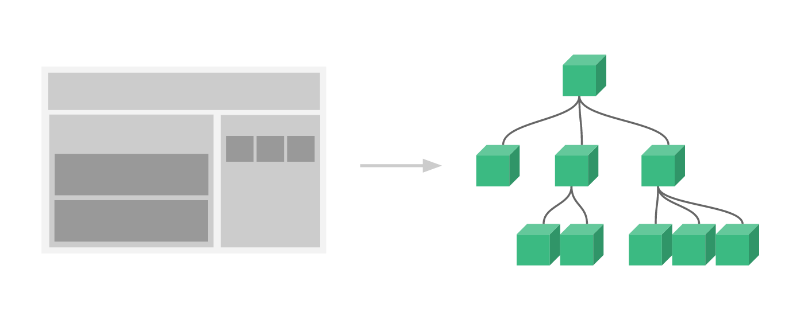

# 一、介绍

## 1、Vue.js 是什么

Vue (读音 /vjuː/，类似于 view) 是一套用于构建用户界面的渐进式框架。

Vue 的核心库只关注视图层，不仅易于上手，还便于与第三方库或既有项目整合。另一方面，当与现代化的工具链以及各种支持类库结合使用时，Vue 也完全能够为复杂的单页应用提供驱动。

官方网站：https://cn.vuejs.org 

## 2、初始Vue.js

```html
<!-- id标识vue作用的范围 -->
<div id="app">
    <!-- {{}} 插值表达式，绑定vue中的data数据 -->
    {{ message }}
</div>
<script src="vue.min.js"></script>
<script>
    // 创建一个vue对象
    new Vue({
        el: '#app',//绑定vue作用的范围
        data: {//定义页面中显示的模型数据
            message: 'Hello Vue!'
        }
    })
</script>
```

这就是声明式渲染：Vue.js 的核心是一个允许采用简洁的模板语法来声明式地将数据渲染进 DOM 的系统

这里的核心思想就是没有繁琐的DOM操作，例如jQuery中，我们需要先找到div节点，获取到DOM对象，然后进行一系列的节点操作

**在vs code中创建代码片段：**

文件 =>  首选项 => 用户代码片段 => 新建全局代码片段/或文件夹代码片段：vue-html.code-snippets

**注意：制作代码片段的时候，字符串中如果包含文件中复制过来的“Tab”键的空格，要换成“空格键”的空格**

```javascript
{
    "vue htm": {
        "scope": "html",
        "prefix": "vuehtml",
        "body": [
            "<!DOCTYPE html>",
            "<html lang=\"en\">",
            "",
            "<head>",
            "    <meta charset=\"UTF-8\">",
            "    <meta name=\"viewport\" content=\"width=device-width, initial-scale=1.0\">",
            "    <meta http-equiv=\"X-UA-Compatible\" content=\"ie=edge\">",
            "    <title>Document</title>",
            "</head>",
            "",
            "<body>",
            "    <div id=\"app\">",
            "",
            "    </div>",
            "    <script src=\"vue.min.js\"></script>",
            "    <script>",
            "        new Vue({",
            "            el: '#app',",
            "            data: {",
            "                $1",
            "            }",
            "        })",
            "    </script>",
            "</body>",
            "",
            "</html>",
        ],
        "description": "my vue template in html"
    }
}
```

# 二、基本语法

## 1、基本数据渲染和指令

你看到的 v-bind 特性被称为指令。指令带有前缀 v- 

除了使用插值表达式{{}}进行数据渲染，也可以使用 v-bind指令，它的简写的形式就是一个冒号（:）

```html
data: {
    content: '我是标题',
    message: '页面加载于 ' + new Date().toLocaleString()
}
```

```html
<!-- 如果要将模型数据绑定在html属性中，则使用 v-bind 指令
     此时title中显示的是模型数据
-->
<h1 v-bind:title="message">
    {{content}}
</h1>
<!-- v-bind 指令的简写形式： 冒号（:） -->
<h1 :title="message">
    {{content}}
</h1>
```

## 2、双向数据绑定

双向数据绑定和单向数据绑定：使用 v-model 进行双向数据绑定

```html
data: {
    searchMap:{
        keyWord: '尚硅谷'
    }
}
```

```html
<!-- v-bind:value只能进行单向的数据渲染 自己变-->
<input type="text" v-bind:value="searchMap.keyWord">
<!-- v-model 可以进行双向的数据绑定 大家一起变 -->
<input type="text" v-model="searchMap.keyWord">
<p>您要查询的是：{{searchMap.keyWord}}</p>
```

## 3、事件

**需求：**点击查询按钮，按照输入框中输入的内容查找公司相关信息

在前面的例子基础上，data节点中增加 result，增加 methods节点 并定义 search方法

```html
data: {
     searchMap:{
         keyWord: '尚硅谷'
     },
     //查询结果
     result: {}
},
methods:{
    search(){
        console.log('search')
        //TODO
    }
}
```

html中增加 button 和 p

使用 v-on 进行数件处理，v-on:click 表示处理鼠标点击事件，事件调用的方法定义在 vue 对象声明的 methods 节点中

```html
<!-- v-on 指令绑定事件，click指定绑定的事件类型，事件发生时调用vue中methods节点中定义的方法 -->
<button v-on:click="search()">查询</button>
<p>您要查询的是：{{searchMap.keyWord}}</p>
<p><a v-bind:href="result.site" target="_blank">{{result.title}}</a></p>
```

完善search方法

```html
search(){
    console.log('search');
    this.result = {
        "title":"尚硅谷",
        "site":"http://www.atguigu.com"
    }
}
```

简写

```html
<!-- v-on 指令的简写形式 @ -->
<button @click="search()">查询</button>
<button @click="search">查询</button>
```

## 4、修饰符

修饰符 (Modifiers) 是以半角句号（.）指明的特殊后缀，用于指出一个指令应该以特殊方式绑定。

例如，.prevent 修饰符告诉 v-on 指令对于触发的事件调event.preventDefault()：

即阻止事件原本的默认行为

```html
data: {
    user: {}
}
```

```html
<!-- 修饰符用于指出一个指令应该以特殊方式绑定。
     这里的 .prevent 修饰符告诉 v-on 指令对于触发的事件调用js的 event.preventDefault()：
     即阻止表单提交的默认行为 -->
<form action="save" v-on:submit.prevent="onSubmit">
    <label for="username">
        <input type="text" id="username" v-model="user.username">
        <button type="submit">保存</button>
    </label>
</form>
```

```html
methods: {
    onSubmit() {
        if (this.user.username) {
            console.log('提交表单')
        } else {
            alert('请输入用户名')
        }
    }
}
```

## 5、条件渲染

v-if：条件指令

```html
data: {
    ok: false
}
```

注意：单个复选框绑定到布尔值

```html
<input type="checkbox" v-model="ok">同意许可协议
<!-- v:if条件指令：还有v-else、v-else-if 切换开销大 -->
<h1 v-if="ok">if：Lorem ipsum dolor sit amet.</h1>
<h1 v-else>no</h1>
```

v-show：条件指令

使用v-show完成和上面相同的功能

```html
<!-- v:show 条件指令 初始渲染开销大 -->
<h1 v-show="ok">show：Lorem ipsum dolor sit amet.</h1>
<h1 v-show="!ok">no</h1>
```

- `v-if` 是“真正”的条件渲染，因为它会确保在切换过程中条件块内的事件监听器和子组件适当地被销毁和重建。
- `v-if` 也是**惰性的**：如果在初始渲染时条件为假，则什么也不做——直到条件第一次变为真时，才会开始渲染条件块。
- 相比之下，`v-show` 就简单得多——不管初始条件是什么，元素总是会被渲染，并且只是简单地基于 CSS 进行切换。
- 一般来说，`v-if` 有更高的切换开销，而 `v-show` 有更高的初始渲染开销。因此，如果需要非常频繁地切换，则使用 `v-show` 较好；如果在运行时条件很少改变，则使用 `v-if` 较好。

## 6、列表渲染

v-for：列表循环指令

**例1：简单的列表渲染**

```html
<!-- 1、简单的列表渲染 -->
<ul>
    <li v-for="n in 10">{{ n }} </li>
</ul>
<ul>
    <!-- 如果想获取索引，则使用index关键字，注意，圆括号中的index必须放在后面 -->
    <li v-for="(n, index) in 5">{{ n }} - {{ index }} </li>
</ul>
```

**例2：遍历数据列表**

```html
data: {
    userList: [
        { id: 1, username: 'helen', age: 18 },
        { id: 2, username: 'peter', age: 28 },
        { id: 3, username: 'andy', age: 38 }
    ]
}
```

```html
<!-- 2、遍历数据列表 -->
<table border="1">
    <!-- <tr v-for="item in userList"></tr> -->
    <tr v-for="(item, index) in userList">
        <td>{{index}}</td>
        <td>{{item.id}}</td>
        <td>{{item.username}}</td>
        <td>{{item.age}}</td>
    </tr>
</table>
```

# 三、组件（重点）

组件（Component）是 Vue.js 最强大的功能之一。

组件可以扩展 HTML 元素，封装可重用的代码。

组件系统让我们可以用独立可复用的小组件来构建大型应用，几乎任意类型的应用的界面都可以抽象为一个组件树：



## 1、局部组件

定义组件

```html
var app = new Vue({
    el: '#app',
    // 定义局部组件，这里可以定义多个局部组件
    components: {
        //组件的名字
        'Navbar': {
            //组件的内容
            template: '<ul><li>首页</li><li>学员管理</li></ul>'
        }
    }
})
```

使用组件

```html
<div id="app">
    <Navbar></Navbar>
</div>
```

## 2、全局组件

定义全局组件：components/Navbar.js

```html
// 定义全局组件
Vue.component('Navbar', {
    template: '<ul><li>首页</li><li>学员管理</li><li>讲师管理</li></ul>'
})
```

```html
<div id="app">
    <Navbar></Navbar>
</div>
<script src="vue.min.js"></script>
<script src="components/Navbar.js"></script>
<script>
    var app = new Vue({
        el: '#app'
    })
</script>
```

# 四、实例生命周期


```javascript
data: {
	message: '床前明月光'
},
methods: {
	show() {
	console.log('执行show方法')
	},
update() {
	this.message = '玻璃好上霜'
	}
},
```

```html
<button @click="update">update</button>
<h3 id="h3">{{ message }}</h3>
```

分析生命周期相关方法的执行时机

```javascript
//===创建时的四个事件
beforeCreate() { // 第一个被执行的钩子方法：实例被创建出来之前执行
    console.log(this.message) //undefined
    this.show() //TypeError: this.show is not a function
    // beforeCreate执行时，data 和 methods 中的 数据都还没有没初始化
},
created() { // 第二个被执行的钩子方法
    console.log(this.message) //床前明月光
    this.show() //执行show方法
    // created执行时，data 和 methods 都已经被初始化好了！
    // 如果要调用 methods 中的方法，或者操作 data 中的数据，最早，只能在 created 中操作
},
beforeMount() { // 第三个被执行的钩子方法
    console.log(document.getElementById('h3').innerText) //{{ message }}
    // beforeMount执行时，模板已经在内存中编辑完成了，尚未被渲染到页面中
},
mounted() { // 第四个被执行的钩子方法
    console.log(document.getElementById('h3').innerText) //床前明月光
    // 内存中的模板已经渲染到页面，用户已经可以看见内容
},
//===运行中的两个事件
beforeUpdate() { // 数据更新的前一刻
    console.log('界面显示的内容：' + document.getElementById('h3').innerText)
    console.log('data 中的 message 数据是：' + this.message)
    // beforeUpdate执行时，内存中的数据已更新，但是页面尚未被渲染
},
updated() {
    console.log('界面显示的内容：' + document.getElementById('h3').innerText)
    console.log('data 中的 message 数据是：' + this.message)
    // updated执行时，内存中的数据已更新，并且页面已经被渲染
}
```

# 五、路由

Vue.js 路由允许我们通过不同的 URL 访问不同的内容。

通过 Vue.js 可以实现多视图的单页Web应用（single page web application，SPA）。

Vue.js 路由需要载入 vue-router 库

## 1、引入js

```html
<script src="vue.min.js"></script>
<script src="vue-router.min.js"></script>
```

## 2、编写html

```html
<div id="app">
    <h1>Hello App!</h1>
    <p>
        <!-- 使用 router-link 组件来导航. -->
        <!-- 通过传入 `to` 属性指定链接. -->
        <!-- <router-link> 默认会被渲染成一个 `<a>` 标签 -->
        <router-link to="/">首页</router-link>
        <router-link to="/student">会员管理</router-link>
        <router-link to="/teacher">讲师管理</router-link>
    </p>
    <!-- 路由出口 -->
    <!-- 路由匹配到的组件将渲染在这里 -->
    <router-view></router-view>
</div>
```

## 3、编写js

```html
<script>
    // 1. 定义（路由）组件。
    // 可以从其他文件 import 进来
    const Welcome = { template: '<div>欢迎</div>' }
    const Student = { template: '<div>student list</div>' }
    const Teacher = { template: '<div>teacher list</div>' }
    // 2. 定义路由
    // 每个路由应该映射一个组件。
    const routes = [
        { path: '/', redirect: '/welcome' }, //设置默认指向的路径
        { path: '/welcome', component: Welcome },
        { path: '/student', component: Student },
        { path: '/teacher', component: Teacher }
    ]
    // 3. 创建 router 实例，然后传 `routes` 配置
    const router = new VueRouter({
        routes // （缩写）相当于 routes: routes
    })
    // 4. 创建和挂载根实例。
    // 从而让整个应用都有路由功能
    const app = new Vue({
        el: '#app',
        router
    })
    // 现在，应用已经启动了！
</script>
```

# 六、axios

axios是独立于vue的一个项目，基于promise用于浏览器和node.js的http客户端

- 在浏览器中可以帮助我们完成 ajax请求的发送
- 在node.js中可以向远程接口发送请求

## 1、获取数据

```html
<script src="vue.min.js"></script>
<script src="axios.min.js"></script>
```

注意：测试时需要开启后端服务器，并且后端开启跨域访问权限

```javascript
var app = new Vue({
    el: '#app',
    data: {
        memberList: []//数组
    },
    created() {
        this.getList()
    },
    methods: {
        getList(id) {
            //vm = this
            axios.get('http://localhost:8081/admin/ucenter/member')
                .then(response => {
                console.log(response)
                this.memberList = response.data.data.items
            })
                .catch(error => {
                console.log(error)
            })
        }
    }
})
```

**控制台查看输出**

## 2、显示数据

```html
<div id="app">
    <table border="1">
        <tr>
            <td>id</td>
            <td>姓名</td>
        </tr>
        <tr v-for="item in memberList">
            <td>{{item.memberId}}</td>
            <td>{{item.nickname}}</td>
        </td>
    </tr>
</table>
</div>
```

# 七、element-ui

element-ui 是饿了么前端出品的基于 Vue.js的 后台组件库，方便程序员进行页面快速布局和构建

官网： http://element-cn.eleme.io/#/zh-CN 

创建 06-element-ui.html

将element-ui引入到项目


## 1、引入css

```html
<!-- import CSS -->
<link rel="stylesheet" href="element-ui/lib/theme-chalk/index.css">
```

## 2、引入js

```html
<!-- import Vue before Element -->
<script src="vue.min.js"></script>
<!-- import JavaScript -->
<script src="element-ui/lib/index.js"></script>
```

## 3、编写html

```html
<div id="app">
    <el-button @click="visible = true">Button</el-button>
    <el-dialog :visible.sync="visible" title="Hello world">
        <p>Try Element</p>
    </el-dialog>
</div>
```

关于.sync的扩展阅读

https://www.jianshu.com/p/d42c508ea9de 

## 4、编写js

```html
<script>
    new Vue({
      el: '#app',
      data: function () {//定义Vue中data的另一种方式
        return { visible: false }
      }
    })
</script>
```

**测试**

其他ui组件我们在项目中学习