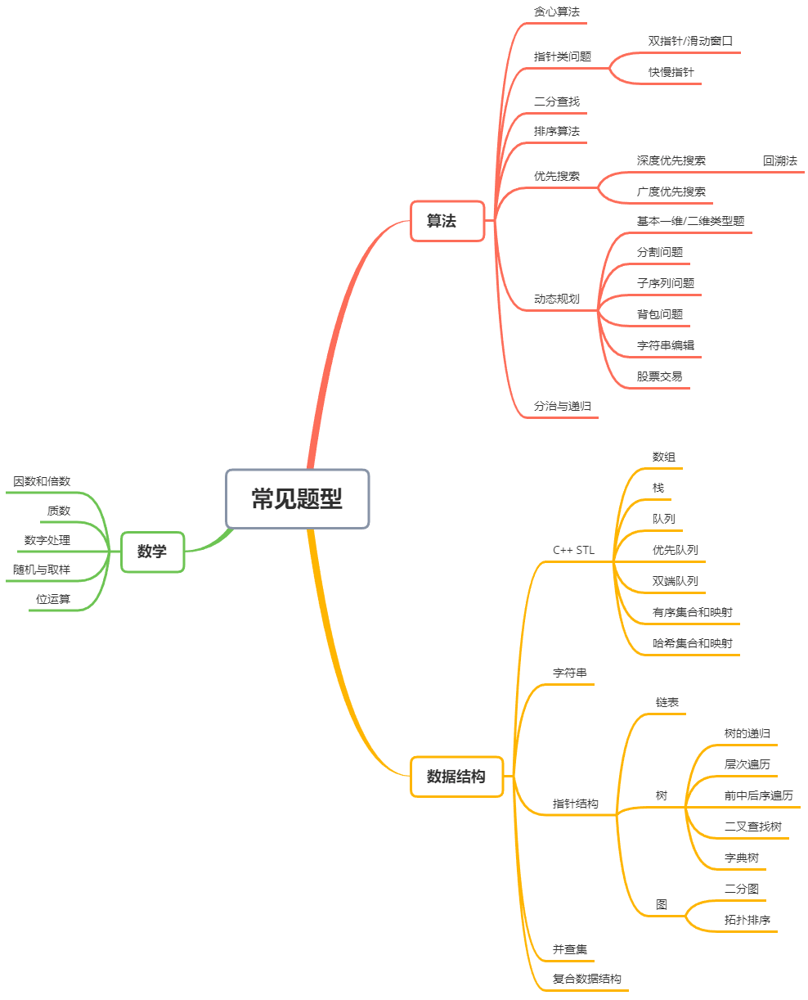

# 第1章 题目分类



# 第2章 最易懂的贪心算法  

顾名思义， 贪心算法或贪心思想采用贪心的策略，保证每次操作都是局部最优的，从而使最后得到的结果是全局最优的。  

# 第3章 玩转双指针  

双指针主要用于遍历数组，两个指针指向不同的元素，从而协同完成任务。也可以延伸到多个数组的多个指针。
若两个指针指向同一数组，遍历方向相同且不会相交，则也称为滑动窗口（两个指针包围的区域即为当前的窗口），经常用于区间搜索。
若两个指针指向同一数组，但是遍历方向相反，则可以用来进行搜索，待搜索的数组往往是排好序的。  

# 第4章 居合斩！二分查找  

二分查找也常被称为二分法或者折半查找，每次查找时通过将待查找区间分成两部分并只取
一部分继续查找，将查找的复杂度大大减少。对于一个长度为 O„n” 的数组，二分查找的时间复
杂度为 O„log n”。
举例来说，给定一个排好序的数组 {3,4,5,6,7}，我们希望查找 4 在不在这个数组内。第一次
折半时考虑中位数 5，因为 5 大于 4, 所以如果 4 存在于这个数组，那么其必定存在于 5 左边这一
半。于是我们的查找区间变成了 {3,4,5}。（注意，根据具体情况和您的刷题习惯，这里的 5 可以
保留也可以不保留，并不影响时间复杂度的级别。）第二次折半时考虑新的中位数 4，正好是我们
需要查找的数字。于是我们发现，对于一个长度为 5 的数组，我们只进行了 2 次查找。如果是遍
历数组，最坏的情况则需要查找 5 次。
我们也可以用更加数学的方式定义二分查找。给定一个在 »a; b… 区间内的单调函数 f „x”，若
f „a” 和 f „b” 正负性相反，那么必定存在一个解 c，使得 f „c” = 0。在上个例子中， f „x” 是离散函数
f „x” = x +2，查找 4 是否存在等价于求 f „x”-4 = 0 是否有离散解。因为 f „1”-4 = 3-4 = -1 < 0、
f „5” - 4 = 7 - 4 = 3 > 0，且函数在区间内单调递增，因此我们可以利用二分查找求解。如果最后
二分到了不能再分的情况，如只剩一个数字，且剩余区间里不存在满足条件的解，则说明不存在
离散解，即 4 不在这个数组内。
具体到代码上，二分查找时区间的左右端取开区间还是闭区间在绝大多数时候都可以，因此
有些初学者会容易搞不清楚如何定义区间开闭性。这里我提供两个小诀窍，第一是尝试熟练使用
一种写法，比如左闭右开（满足 C++、 Python 等语言的习惯）或左闭右闭（便于处理边界条件），
尽量只保持这一种写法；第二是在刷题时思考如果最后区间只剩下一个数或者两个数，自己的写
法是否会陷入死循环，如果某种写法无法跳出死循环，则考虑尝试另一种写法。
二分查找也可以看作双指针的一种特殊情况，但我们一般会将二者区分。双指针类型的题，
指针通常是一步一步移动的，而在二分查找里，指针每次移动半个区间长度。  

# 第5章 千奇百怪的排序算法  

## 1.快速排序

我们采用左闭右闭的二分写法。

``` java
void quick_sort(vector<int> &nums, int l, int r) {
    if (l + 1 >= r) {
        return;
    }
    int first = l, last = r - 1, key = nums[first];
    while (first < last){
        while(first < last && nums[last] >= key) {
            --last;
        }
        nums[first] = nums[last];
        while (first < last && nums[first] <= key) {
            ++first;
        }
        nums[last] = nums[first];
    }
    nums[first] = key;
    quick_sort(nums, l, first);
    quick_sort(nums, first + 1, r);
}  
```

```java
void QuickSort(int arr[], int low, int high) {
    int pivotPos;
    if (low < high) {
        pivotPos = Partition(arr, low, high);
        QuickSort(arr, low, pivotPos - 1);
        QuickSort(arr, pivotPos + 1, high);
    }
}

void Swap(int[] a, int i, int j) {
    int flag = a[i];
    a[i] = a[j];
    a[j] = flag;
}

int Partition(int a[], int p, int r) {
    int x=a[r];
    int i=p-1;
    for (int j = p; j < r; j++) {
        if(a[j]<=x){
            i++;
            Swap(a,i,j);
        }
    }
    Swap(a,i+1,r);
    return i+1;
}
```

## 2.归并排序  

```java
void merge_sort(vector<int> &nums, int l, int r, vector<int> &temp) {
    if (l + 1 >= r) {
        return;
    }
    // divide
    int m = l + (r - l) / 2;
    merge_sort(nums, l, m, temp);
    merge_sort(nums, m, r, temp);
    // conquer
    int p = l, q = m, i = l;
    while (p < m || q < r) {
        if (q >= r || (p < m && nums[p] <= nums[q])) {
            temp[i++] = nums[p++];
        } else {
            temp[i++] = nums[q++];
        }
    }
    for (i = l; i < r; ++i) {
        nums[i] = temp[i];
    }
}
```

## 3.插入排序  

```java
void insertion_sort(vector<int> &nums, int n) {
    for (int i = 0; i < n; ++i) {
        for (int j = i; j > 0 && nums[j] < nums[j-1]; --j) {
            swap(nums[j], nums[j-1]);
        }
    }
}
```

## 4.冒泡排序  

```java
void bubble_sort(vector<int> &nums, int n) {
    bool swapped;
    for (int i = 1; i < n; ++i) {
        swapped = false;
        for (int j = 1; j < n - i + 1; ++j) {
            if (nums[j] < nums[j-1]) {
                swap(nums[j], nums[j-1]);
                swapped = true;
            }
        }
        if (!swapped) {
            break;
        }
    }
}
```

## 5.选择排序  

```java
void selection_sort(vector<int> &nums, int n) {
    int mid;
    for (int i = 0; i < n - 1; ++i) {
        mid = i;
        for (int j = i + 1; j < n; ++j) {
            if (nums[j] < nums[mid]) {
                mid = j;
            }
        }
        swap(nums[mid], nums[i]);
    }
}
```

# 第6章 一切皆可搜索  

## 1.深度优先搜索  

深度优先搜索（depth-first seach， DFS）在搜索到一个新的节点时，立即对该新节点进行遍历；因此遍历需要用先入后出的栈来实现，也可以通过与栈等价的递归来实现。对于树结构而言，由于总是对新节点调用遍历，因此看起来是向着“深”的方向前进。  

## 2.回溯法
回溯法（backtracking）是优先搜索的一种特殊情况，又称为试探法，常用于需要记录节点状态的深度优先搜索。通常来说，排列、组合、选择类问题使用回溯法比较方便。
顾名思义，回溯法的核心是回溯。在搜索到某一节点的时候，如果我们发现目前的节点（及其子节点）并不是需求目标时，我们回退到原来的节点继续搜索，并且把在目前节点修改的状态还原。这样的好处是我们可以始终只对图的总状态进行修改，而非每次遍历时新建一个图来储存
状态。在具体的写法上，它与普通的深度优先搜索一样，都有 [修改当前节点状态]![递归子节点] 的步骤，只是多了回溯的步骤，变成了 [修改当前节点状态]![递归子节点]![回改当前节点状态]。
没有接触过回溯法的读者可能会不明白我在讲什么，这也完全正常，希望以下几道题可以让您理解回溯法。如果还是不明白，可以记住两个小诀窍， 一是按引用传状态， 二是所有的状态修改在递归完成后回改。
回溯法修改一般有两种情况，一种是修改最后一位输出，比如排列组合；一种是修改访问标记，比如矩阵里搜字符串。

## 3.广度优先搜索
​		广度优先搜索（breadth-first search， BFS）不同与深度优先搜索，它是一层层进行遍历的，因此需要用先入先出的队列而非先入后出的栈进行遍历。由于是按层次进行遍历，广度优先搜索时按照“广”的方向进行遍历的，也常常用来处理最短路径等问题。
​		这里要注意，深度优先搜索和广度优先搜索都可以处理可达性问题，即从一个节点开始是否能达到另一个节点。因为深度优先搜索可以利用递归快速实现，很多人会习惯使用深度优先搜索刷此类题目。实际软件工程中，笔者很少见到递归的写法，因为一方面难以理解，另一方面可能
产生栈溢出的情况；而用栈实现的深度优先搜索和用队列实现的广度优先搜索在写法上并没有太大差异，因此使用哪一种搜索方式需要根据实际的功能需求来判断。    

# 第7章 深入浅出动态规划

​		“动态规划（Dynamic Programming, DP）在查找有很多重叠子问题的情况的最优解时有效。它将问题重新组合成子问题。为了避免多次解决这些子问题，它们的结果都逐渐被计算并被保存，从简单的问题直到整个问题都被解决。因此，动态规划保存递归时的结果，因而不会在解决同样的问题时花费时间 · · · · · · 动态规划只能应用于有最优子结构的问题。最优子结构的意思是局部最优解能决定全局最优解（对有些问题这个要求并不能完全满足，故有时需要引入一定的近似）。简单地说，问题能够分解成子问题来解决。”

​		通俗一点来讲，动态规划和其它遍历算法（如深/广度优先搜索）都是将原问题拆成多个子问题然后求解，他们之间最本质的区别是，动态规划保存子问题的解， 避免重复计算。解决动态规划问题的关键是找到状态转移方程，这样我们可以通过计算和储存子问题的解来求解最终问题。

​		同时，我们也可以对动态规划进行空间压缩，起到节省空间消耗的效果。这一技巧笔者将在之后的题目中介绍。

​		在一些情况下，动态规划可以看成是带有状态记录（memoization）的优先搜索。状态记录的意思为，如果一个子问题在优先搜索时已经计算过一次，我们可以把它的结果储存下来，之后遍历到该子问题的时候可以直接返回储存的结果。动态规划是自下而上的，即先解决子问题，再解决父问题；而用带有状态记录的优先搜索是自上而下的，即从父问题搜索到子问题，若重复搜索到同一个子问题则进行状态记录，防止重复计算。如果题目需求的是最终状态，那么使用动态搜索比较方便；如果题目需要输出所有的路径，那么使用带有状态记录的优先搜索会比较方便。  

# 第8章 化繁为简的分治法  

​		顾名思义， 分治问题由“分”（divide）和“治”（conquer）两部分组成，通过把原问题分为子问题，再将子问题进行处理合并，从而实现对原问题的求解。我们在排序章节展示的归并排序就是典型的分治问题，其中“分”即为把大数组平均分成两个小数组，通过递归实现，最终我们会得到多个长度为 1 的子数组;“治”即为把已经排好序的两个小数组合成为一个排好序的大数组，从长度为 1 的子数组开始，最终合成一个大数组。  

# 第9章 神奇的位运算

位运算是算法题里比较特殊的一种类型，它们利用二进制位运算的特性进行一些奇妙的优化和计算。常用的位运算符号包括：“^”按位异或、“&”按位与、“j”按位或、“∼”取反、“<<”算术左移和“>>”算术右移。以下是一些常见的位运算特性，其中 0s 和 1s 分别表示只由 0 或 1构成的二进制数字。

| x ^ 0s = x | x & 0s = 0 | x \| 0s = x |
| ----------- | ---------- | ---- |
| x ^ 1s = ~x | x & 1s = x | x \| 1s = 1 |
| x ^ x = 0 | x & x = x | x \| x = x |


除此之外， n & (n - 1) 可以去除 n 的位级表示中最低的那一位，例如对于二进制表示 11110100，减去 1 得到 11110011，这两个数按位与得到 11110000。 n & (-n) 可以得到 n 的位级表示中最低的那一位，例如对于二进制表示 11110100，取负得到 00001100，这两个数按位与得到 00000100。

