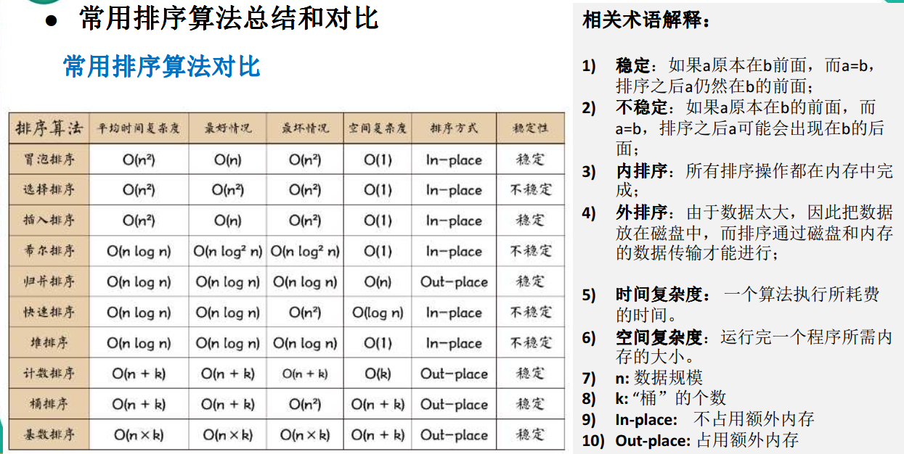

# 1.冒泡排序

```java
public static void bubbleSort(int[] arr) {
    int temp = 0;
    boolean flag = false;
    for (int i = 0; i < arr.length - 1; i++) {
        for (int j = 0; j < arr.length - 1 - i; j++) {
            if (arr[j] > arr[j + 1]) {
                flag = true;
                temp = arr[j];
                arr[j] = arr[j + 1];
                arr[j + 1] = temp;
            }
        }
        if (!flag) {
            break;
        } else {
            flag = false;
        }
    }
}
```

# 2.选择排序

```java
public static void selectSort(int[] arr) {
    for (int i = 0; i < arr.length - 1; i++) {
        int min = arr[i];
        int minIndex = i;
        for (int j = i + 1; j < arr.length; j++) {// 遍历
            if (min > arr[j]) { // 说明min不是真的最小值
                min = arr[j]; // 重置min
                minIndex = j; // 重置minIndex
            }
        }
        if (minIndex != i) {// 判断是否需要交换
            arr[minIndex] = arr[i];
            arr[i] = min;
        }
    }
}
```

# 3.插入排序

```java
public static void insertSort(int[] arr){
    for (int i = 1; i < arr.length ; i++) {
        int insertVal=arr[i];
        int insertIndex=i-1;
        while (insertIndex>=0&&insertVal<arr[insertIndex]){
            arr[insertIndex+1]=arr[insertIndex];
            insertIndex-=1;
        }
        arr[insertIndex+1]=insertVal;
    }
}
```

# 4.希尔排序

```java
/**
 * 希尔排序: 对有序序列在插入时采用交换法
 */
public static void shellSort(int[] arr) {
    // 遍历所有的步长
    for (int d = arr.length / 2; d > 0; d /= 2) {
        // 遍历所有有元素
        for (int i = d; i < arr.length; i++) {
            // 遍历本组中所有的元素
            for (int j = i - d; j >= 0; j -= d) {
                // 如果当前元素大于加上步长后的那个元素
                if (arr[j] > arr[j + d]) {
                    int temp = arr[j];
                    arr[j] = arr[j + d];
                    arr[j + d] = temp;
                }
            }
        }
    }
}

/**
 * 希尔排序: 对有序序列在插入时采用移动法
 */
public static void shellSort2(int[] arr) {
    // 增量gap，并逐步缩小增量
    for (int gap = arr.length / 2; gap > 0; gap /= 2) {
        // 从第gap个元素，逐个对其所在组进行直接插入排序操作
        for (int i = gap; i < arr.length; i++) {
            int j = i;
            int temp = arr[j];
            if (arr[j] < arr[j - gap]) {
                while (j - gap >= 0 && temp < arr[j - gap]) {
                    // 移动法
                    arr[j] = arr[j - gap];
                    j -= gap;
                }
                arr[j] = temp;
            }
        }
    }
}
```

# 5.快速排序

```java
public static void quickSort(int[] arr, int left, int right) {
    if (left > right) {
        return;
    }
    int base = arr[left];
    int i = left;
    int j = right;
    while (i != j) {
        while (arr[j] >= base && i < j) {
            j--;
        }
        while (arr[i] <= base && i < j) {
            i++;
        }
        if (i != j) {
            int temp = arr[i];
            arr[i] = arr[j];
            arr[j] = temp;
        }
    }
    arr[left] = arr[i];
    arr[i] = base;
    quickSort(arr,left,i-1);
    quickSort(arr,j+1,right);
}
```

# 6.归并排序

```java
public static void mergeSort(int[] arr, int left, int right, int[] temp) {
    if (left < right) {
        int mid = (left + right) / 2;
        mergeSort(arr,left,mid,temp);
        mergeSort(arr,mid+1,right,temp);
        merge(arr,left,mid,right,temp);
    }
}
public static void merge(int[] arr, int left, int mid, int right, int[] temp) {
    int i = left;
    int j = mid + 1;
    int t = 0;
    while (i <= mid && j <= right) {
        if (arr[i] <= arr[j]) {
            temp[t++] = arr[i++];
        } else {
            temp[t++] = arr[j++];
        }
    }
    while (i <= mid) {
        temp[t++] = arr[i++];
    }
    while (j <= right) {
        temp[t++] = arr[j++];
    }
    t = 0;
    int tempLeft = left;
    while (tempLeft <= right) {
        arr[tempLeft++] = temp[t++];
    }
}
```

# 7.基数排序

```java
public static void radixSort(int[] arr) {
    int max = arr[0];
    for (int value : arr) {
        if (value > max) max = value;
    }
    int maxLength = (max + "").length();
    int[][] bucket = new int[10][arr.length];
    int[] bucketElementCounts = new int[10];
    for (int i = 0, n = 1; i < maxLength; i++, n *= 10) {
        for (int value : arr) {
            int digitOfElement = value / n % 10;
            bucket[digitOfElement][bucketElementCounts[digitOfElement]++] = value;
        }
        int index = 0;
        for (int k = 0; k < bucket.length; k++) {
            if (bucketElementCounts[k] != 0) {
                for (int l = 0; l < bucketElementCounts[k]; l++) {
                    arr[index++] = bucket[k][l];
                }
            }
            bucketElementCounts[k] = 0;
        }
    }
}
```

